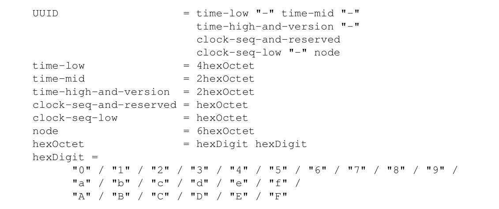
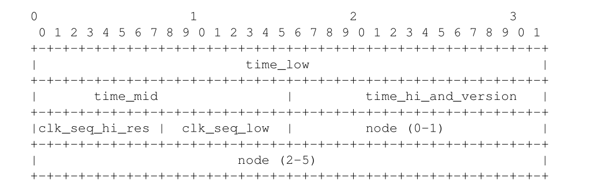

# UUID简介 #

UUID 是通用唯一识别码(Universally Unique IDentifier) 的缩写, 也被称为 GUID(全局唯一标识符, Globally Uniue IDentifier). 它可以让分布式系统中的所有元素都拥有唯一的标识符, 而不需要中央控制段的帮助.

UUID 的长度为 128 位, 即 16 个字节. UUID 的结构可以描述如下:

其中各个字段的描述如下:

| 字段      | 数据类型                | 字节范围 | 备注             |
| :--       | :--                     | :--      | :--              |
| time\_low | unsigned 32 bit integer | 0-3      | 时间戳的低字节位 |
| time\_mid | unsigned 16 bit integer | 4-5      |  时间戳的中间字节位 |
| time\_hi\_and\_version | unsigned 16 bit integer | 6-7 | 时间戳的高字节位和版本号组成 |
| clock\_seq\_hi\_and\_reserved | unsigned 8 bit integer | 8 | 时钟序列的高字节位乘以 variant |
| clock\_seq\_low | unsigned 8 bit integer | 9 | 时钟序列的低字节位 |
| node | unsigned 48 bit integer | 10-15 | 节点的唯一标识符 |

各个字段的顺序结构图如下:

## 版本号 ##

版本号是 UUID 中的重要字段, 包含在 time\_hi\_and\_version 字段中, 当前已经定义的版本号如下:

| Msb0 | Msb1 | Msb2 | Msb3 | 版本号 | 描述 |
|:--|:--|:--|:--|:--|:--|
| 0 | 0 | 0 | 1 | 1 | 基于时间的UUID |
| 0 | 0 | 1 | 0 | 2 | DEC安全的UUID, 使用 POSIX UID |
| 0 | 0 | 1 | 1 | 3 | 基于名字的UUID, 使用 MD5 散列算法 |
| 0 | 1 | 0 | 0 | 4 | 随机UUID |
| 0 | 1 | 0 | 1 | 5 | 基于名字的UUID, 使用 SHA-1 散列算法 |

## 时间戳 ##

时间戳是一个 60 位的值, 针对不同的 UUID 版本的计算方式不同:

- 针对版本1, 时间戳是一个从 1582年10月15日 00:00:00.00 开始的以秒为单位的 UTC 间隔时间; 如果系统中不能使用 UTC, 可以使用本地时间, 但是这不是推荐的使用方式
- 针对版本3或版本5, 时间戳是一个从名字中计算出的值
- 针对版本4, 时间戳是使用随机或伪随机方式生成的值

## 时钟序列 ##

- 对于版本1, 时钟序列用于避免出现重复的值. 当时钟被改变时时钟序列也需要被改变, 如果时钟序列的前一个值是已知的, 那么可以简单的增加它, 否则设置为随机值.
- 对于版本3或者版本5, 时钟序列是一个从名字中计算出的14位值
- 对于版本4, 时钟序列是一个使用随机或伪随机方式生成的14位值

## 节点标识符 ##

- 对于版本1, 节点标识符是 MAC地址, 如果没有则设置为随机值.
- 对于版本3或者版本5, 时钟序列是一个从名字中计算出的48位值
- 对于版本4, 时钟序列是一个使用随机或伪随机方式生成的48位值

## 空UUID ##

空UUID 是一个特殊的UUID, 其中所有的位都设置为0.

## 注意事项 ##

- UUID 可能被猜测出来, 例如使用了一个可预测的随机数字源
- UUID 很难通过人类的简单检查来判断是否合法
- 在分布式的主机上生成UUID需要一个可靠的所有主机都能使用随机数字源, 否则应该使用名字版本的 UUID
- UUID 的版本1 有可能会暴露 MAC 地址
