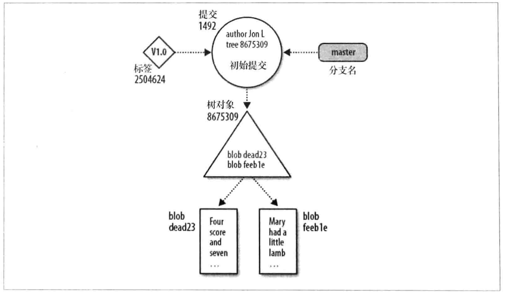
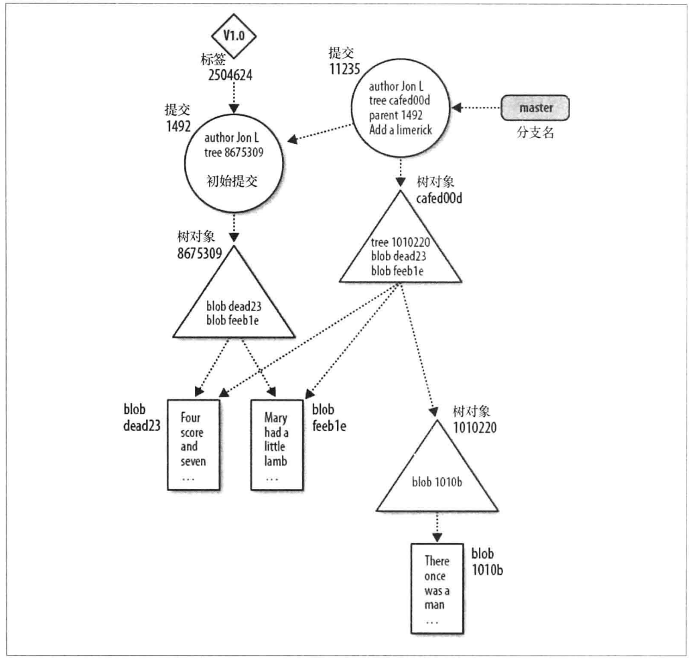

# 第四章: 基本的 Git 概念 #

## 基本概念 ##

### 版本库 ###

Git 版本库只是一个简单的数据库, 其中包含所有用来维护与管理项目的修订版本和历史的信息. 一个版本库维护项目整个生命周期的完整副本, 还提供版本库本身的副本. Git版本库也维护一组配置值.

在版本库中, Git 维护两个主要的数据结构: 对象库和索引. 所有的这些版本库数据存放在工作目录下根目录下一个名为 .git 的隐藏子目录中.

### Git 对象类型 ###

对象库是 Git 版本库实现的心脏, 包含你的原始数据文件和所有日志消息, 作者信息, 日期以及其他用来重建项目任意版本或分支的信息.

Git 放在对象库里的对象包含以下 4 中类型:

- 块(blob): 文件的每一个版本表示为一个块, 一个块保存一个文件的数据, 但不包含任何关于这个文件的元数据, 甚至没有文件名
- 目录树(tree): 一个目录树对象代表一层目录信息, 它记录 blob 标识符, 路径名和在一个目录里所有文件的一些元数据, 也可以递归引用其他目录树或子树对象
- 提交(commit): 一个提交对象保存版本库中每一次变化的元数据, 包括作者, 提交者, 提交日期和日志消息. 每一个提交对象指向一个目录树对象, 这个目录树对象在一张完整的快照中捕获提交时版本库的状态. 大多数提交都有一个父提交.
- 标签(tag): 一个标签对象分配一个任意的且人类可读的名字给一个特定对象, 通常是一个提交对象.

为了有效利用磁盘空间和网络带宽, Git 把对象压缩并存储在打包文件里, 这些文件也在对象库中.

### 索引 ###

索引是一个临时的, 动态的二进制文件, 描述整个版本库的目录结构. 索引捕获项目在某个时刻的整体结构的一个版本, 项目的状态可以用一个提交和一个目录树表示.

可以通过 Git 命令在索引中暂存变更, 索引会记录和保存这些变更, 直到你准备好提交.

### 可寻址内容名称 ###

Git 对象库被组织及实现成一个内容寻址的存储系统, 对象库中的每个对象都有一个唯一的名称, 这个名称是向对象内容应用到 SHA1 得到的 SHA1 散列值.

SHA1 值是一个 160 位的数, 通常表示为一个 40 位的 16 进制数, Git用户说的 SHA1, 散列码和对象ID都是同一个内容.

### Git 追踪内容 ###

Git 的内容追踪主要表现为以下两种方式:

1. Git的对象库是基于对象内容的散列计算的值
2. 当文件从一个版本变化到下一个版本时, Git的内部数据库有效的存储每个文件的每个版本, 而不是它们的差异

### 路径名和内容 ###

Git 把文件名视为一段区别于文件内容的数据, Git 仅仅记录每个路径名, 并且确保能通过它的内容精确的重建文件和目录, 这些是由散列值来索引的.

### 打包文件 ###

Git 使用了一种叫做打包文件的更有效的存储机制. 要创建一个打包文件, Git 首先定位内容非常相似的全部文件, 然后为它们之一存储整个内容; 之后计算相似文件之间的差异并且只存储差异.

Git 也维护打包文件中每个完整文件的原始 blob 的 SHA1 值.

## 对象库图示 ##

- blob 对象是数据结构的底端, 它什么也不引用而且只被树对象引用.
- 树对象指向若干个 blob 对象, 也可能指向其他树对象. 许多不同的提交可能指向任何给定的树对象
- 提交对象指向一个特定的树对象, 并且这个树对象是由提交对象引入版本库
- 标签可以指向最多一个提交对象
- 分支不是基本的 Git 对象

下图显示了一个版本库在添加了两个文件的初始提交之后的状态, 两个文件都在顶级目录中, 同时它们的 master 分支和一个叫 V1.0 的标签都指向一个提交对象.



下图显示了添加一个包含一个新文件的新子目录之后, 版本库的图示:



## Git 在工作时的概念 ##

### 进入 .git 目录 ###

首先查看 git init 创建了什么文件:

```
$ mkdir /tmp/hello
$ cd /tmp/hello
$ git init
$ find .
.
./.git
./.git/refs
./.git/refs/heads
./.git/refs/tags
./.git/objects
./.git/objects/pack
./.git/objects/info
./.git/config
./.git/description
./.git/branches
./.git/hooks
./.git/hooks/update.sample
./.git/hooks/pre-commit.sample
./.git/hooks/pre-push.sample
./.git/hooks/pre-rebase.sample
./.git/hooks/prepare-commit-msg.sample
./.git/hooks/post-update.sample
./.git/hooks/applypatch-msg.sample
./.git/hooks/pre-applypatch.sample
./.git/hooks/commit-msg.sample
./.git/info
./.git/info/exclude
./.git/HEAD
```

然后创建一些对象:

```
$ echo "hello world" > hello.txt
$ git add hello.txt
$ find .git/objects
.git/objects/
.git/objects/3b
.git/objects/3b/18e512dba79e4c8300dd08aeb37f8e728b8dad
.git/objects/pack
.git/objects/info
```

### 对象, 散列和 blob  ###

当为 hello.txt 创建对象的时候, Git 计算它的 SHA1 值, 并把散列值的十六进制表示作为文件名放入对象库中.

Git 会在散列值的前两位数字后插入一个 / 以提高文件系统的效率.

可以使用以下命令查看对象的内容:

```
$ git cat-file -p 3b18e
```

### 文件和树 ###

Git 通过目录树对象来跟踪文件的路径名, 当使用 git add 命令时, 并不会马上为树创建一个对象, 而是更新位于 .git/index 中的索引, 它会跟踪文件的路径名和相应的 blob .

任何时候都可以从当前索引创建一个树对象, 只需要使用 git write-tree 命令来捕获索引当前信息的快照即可:

```
$ git ls-files -s
100644 3b18e512dba79e4c8300dd08aeb37f8e728b8dad 0	hello.txt

$ git write-tree
68aba62e560c0ebc3396e8ae9335232cd93a3f60

$ find .git/objects
.git/objects/
.git/objects/3b
.git/objects/3b/18e512dba79e4c8300dd08aeb37f8e728b8dad
.git/objects/pack
.git/objects/68
.git/objects/68/aba62e560c0ebc3396e8ae9335232cd93a3f60
.git/objects/info

# 查看树对象
$ git cat-file -p 68aba6
100644 blob 3b18e512dba79e4c8300dd08aeb37f8e728b8dad	hello.txt
```

### 对 Git 使用 SHA1 的一点说明 ###

散列函数提供了一种有效的方法来比较两个对象, 甚至是两个非常大而复杂的数据结构, 而且并不需要完全传输.

### 树层次结构 ###

```
$ mkdir subdir
$ cp hello.txt ./subdir
$ git add subdir/hello.txt
$ git write-tree
492413269336d21fac079d4a4672e55d5d2147ac

$ git cat-file -p 492413
100644 blob 3b18e512dba79e4c8300dd08aeb37f8e728b8dad	hello.txt
040000 tree 68aba62e560c0ebc3396e8ae9335232cd93a3f60	subdir
```

新的顶级树包含两个条目, 原始的 hello.txt 以及新的子目录树对象, 而且 subdir 的对象名是 hello.txt 的 SHA1.

查看 .git/objects 目录, 可以发现现在有 3 个对象:

```
$ find .git/objects
.git/objects/
.git/objects/49
.git/objects/49/2413269336d21fac079d4a4672e55d5d2147ac
.git/objects/3b
.git/objects/3b/18e512dba79e4c8300dd08aeb37f8e728b8dad
.git/objects/pack
.git/objects/68
.git/objects/68/aba62e560c0ebc3396e8ae9335232cd93a3f60
.git/objects/info
```

### 提交 ###

```
$ echo -n "Commit a file that says hello\n" | git commit-tree 492413
becb37c9eebf727198f824b1604b6e4cfb3ab4ab

$ git cat-file -p becb37
tree 492413269336d21fac079d4a4672e55d5d2147ac
author lsytj0413 <511121939@qq.com> 1497855788 +0800
committer lsytj0413 <511121939@qq.com> 1497855788 +0800

Commit a file that says hello\n
```

一个基本的提交命令包含:

- 标识关联文件的树对象的名称
- 创作新版本的人的名字和创作的时间
- 把新版本放到版本库的人的名字和提交的时间
- 对本次修订原因的说明

默认情况下, 作者和提交者是同一个人, 但在一些情况下他们是不同的. 可以使用 git show --pretty=fuller 来查看给定提交的其他细节.

### 标签 ###

有两种标签类型: 轻量级的和带附注的. 轻量级的标签只是一个提交对象的引用, 它并不在版本库里创建永久对象; 带附注的标签会创建一个对象, 包含作者提供的一条消息, 并且可以根据 RFC4880 来使用 GnuPG 密钥进行数字签名.

```
# 创建一个附注标签
$ git tag -m "Tag version 1.0" V1.0 becb37
# 找到标签对象的 SHA1
$ git rev-parse V1.0
438ac85536cc969132921b3fbcf3e367171c81ca

$ git cat-file -p 438ac
object becb37c9eebf727198f824b1604b6e4cfb3ab4ab
type commit
tag V1.0
tagger lsytj0413 <511121939@qq.com> 1497856255 +0800

Tag version 1.0
```

Git 通过给指向树对象的提交对象打标签, 这个树对象包含版本库中文件和目录的整个层次结构的总状态.
