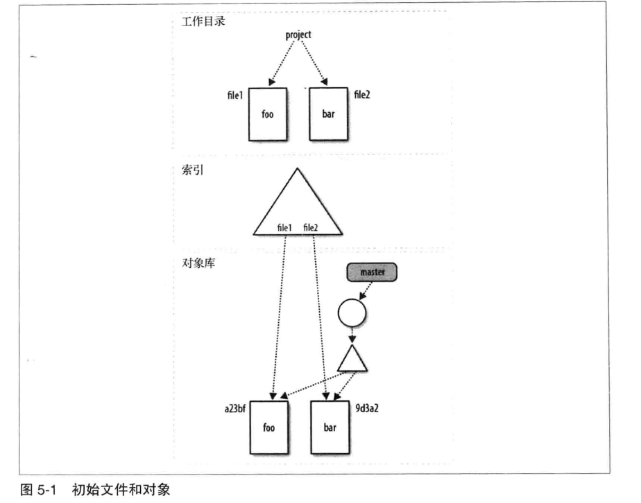

# 第五章: 文件管理和索引 #

当使用 Git 时, 你会在工作目录下编辑, 在索引中积累修改, 然后把索引中积累的修改作为一次性的变更来进行提交.

## 关于索引的一切 ##

Git 的索引不包含任何文件内容, 仅仅是追踪你想要提交的那么内容. 当执行 git commit 命令的时候, Git 会通过检查索引而不是工作目录来找到提交的内容.

在任何时候都可以通过 git status 命令来查询索引的状态, 它会明确展示哪些文件在 Git 看来是暂存的.

可以使用 git diff 命令显示两组不同的差异: git diff 显示仍留在工作目录中且未暂存的变更; git diff --cached 显示已经暂存并且因此要有助于下次提交的变更.

## Git 中的文件分类 ##

Git 将所有文件分为以下 3 类:

- 已追踪的: 指已经在版本库中的文件, 或者是已暂存到索引中的文件
- 被忽略的: 在版本库中明确声明为不可见或被忽略的文件
- 未追踪的: 不在前两类中的文件

```
# 建立新版本库
$ cd /tmp/my_stuff
$ git status

# 添加文件
$ echo "New data" > data
# 显示一个未追踪文件
$ git status

# 忽略文件
$ touch main.o
$ git status
$ echo main.o > .gitignore
# 忽略 main.o, .gitignore显示为未追踪
$ git status
```

## 使用 git add ##

git add 命令将暂存一个文件, 如果一个文件是未追踪的, 那么该命令就会将文件的状态转化为已追踪的; 如果是一个目录, 那么该目录下的文件和子目录都会递归暂存.

```
git status
git add data .gitignore

# 查看暂存文件的 SHA1
git ls-files --stage

# 修改 data 文件并查看新版的 SHA1
echo "And some more data now" >> data
git hash-object data
# 暂存新版本
git add data
git ls-files --stage
```

在发出 git add 命令时每个文件的全部内容都将被复制到对象库中, 并且按照文件的 SHA1 名来索引. 相对于添加这个文件, git add 命令更合适看作添加这个内容.

需要注意的是, 工作目录中的文件版本和索引中暂存的文件版本可能是不同步的, 当提交的时候, Git 会使用索引中的版本.

## 使用 git commit 的一些注意事项 ##

### 使用 git commit --all ###

git commit 的 -a 或者 --all 选项会导致执行提交前自动暂存所有未暂存的和未追踪的文件变化, 包括从工作副本中删除的已追踪的文件. 但是对于一个全新的目录, 而且该目录下没有任何文件名或路径是已追踪的, 那么该选项也不会将其提交.

```
mkdir /tmp/commit-all-example
cd /tmp/commit-all-example
git init

# commit
echo something >> ready
echo something else >> notyet
git add ready notyet
git commit -m "Setup"

echo modify >> ready
git add ready
echo modify >> notyet
mkdir subdir
echo Nope >> subdir/new

git status

# 提交 ready 和 notyet
git commit -all -m "commit"
```

### 编辑提交日志 ###

如果你是在编辑器中编写提交日志, 并决定中止操作, 只需要不保存退出即可; 也可以删除已经编辑的日志消息, 重新保存即可. Git 不会处理空提交.

## 使用 git rm ##

git rm 命令用于从版本库和工作目录中同时删除文件, 它可以从索引或者同时从索引和工作目录中删除.

```
echo "Random stuff" > oops
git rm oops   # didn't match files
git add oops
git status
# 将文件修改为未暂存的
git ls-files --stage
git rm --cached oops

# 从版本库中删除文件
git commit -m "Add some files"
git rm data
git status

# 误删除恢复
git add data # didn't match files
# 从版本库中恢复文件
git checkout HEAD -- data
git status
```

## 使用 git mv ##

如果需要移动或重命名文件, 可以使用 git mv 命令完成. Git 会在索引中删除旧文件的路径名, 然后添加新文件的路径名, 而文件的原始内容仍然保存在对象库中, 只需要和新文件名重新关联即可.

```
git mv data mydata
git commit -m "Moved data to mydata"
# 查看文件的历史记录
git log mydata # 此处Git丢失了原文件的历史记录
# 查找到文件内容的关联历史记录
git log --follow mydata
```

## 追踪重命名注解 ##

Git不追踪重命名, 重命名只会影响对象树, 通过查看对象树的差异可以发现文件的移动.

## .gitignore文件 ##

.gitignore 文件的格式如下:

- 空行被忽略, 以 #符号开始的行被视作注释, 但是如果该符号在其他文本后面则不视为注释
- 简单的字面值文件名匹配任何目录中的同名文件
- 目录名由末尾的反斜线标记, 匹配同名的目录和子目录, 不匹配文件或符号链接
- 包含shell通配符, 一个通配符只能匹配一个文件或目录名, 不能跨目录匹配
- 起始的感叹号会对该行其余部分的模式进行取反, 被之前模式排除但被取反规则匹配的文件是要包含的, 取反模式会覆盖低优先级的规则

Git 允许版本库的任何目录下有 .gitignore 文件, 每个文件都只影响该目录及其所有子目录. 可以覆盖高层目录中的规则, 只需要在其子目录中包含一个取反模式即可.

Git 使用如下的优先级顺序:

- 命令行指定的模式
- 从相同目录的 .gitignore 中读取的模式
- 上层目录的模式
- 来自 .git/info/exclude 文件的模式
- 来自配置变量 core.excludedfile 指定的文件中的模式

## Git中对象模型和文件的详细视图 ##

下面以一个叫 file1 的文件从编辑到在索引中暂存, 再到最终提交的整个过程为例, 解释文件管理的变化与细节.

初始状态如下图所示, 工作目录中包含 file1 和 file2 两个文件, master 分支包含一个提交:



然后编辑 file1, 此时索引和对象库都没有发生变化:


使用 git add file1 暂存变化, 此时对象库中生成了新的 blob 对象, 而且索引中的路径名发生更新, 此时工作目录和索引一致, 但索引中的对象树和master分支中 HEAD 提交的对象树不同:


最后使用 git commit 提交内容:


对于 git commit 来说, 提交会启动三个步骤:

1. 将索引转换成一个真实的树对象, 以SHA1命名, 然后放到对象库中
2. 用日志消息创建一个新的提交对象, 新的提交对象会指向新创建的树对象以及前一个提交或父提交
3. master 分支的引用从最近一次提交移动到新创建的提交对象, 成为新的 master HEAD

在完成这些步骤之后, 工作目录, 索引和对象库再次一致.
