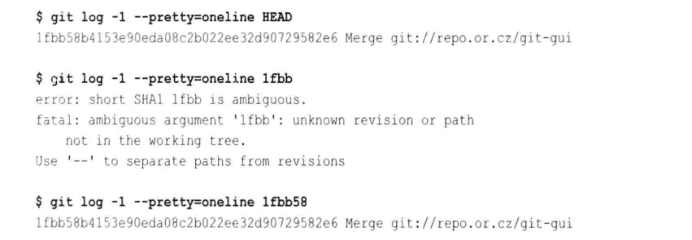
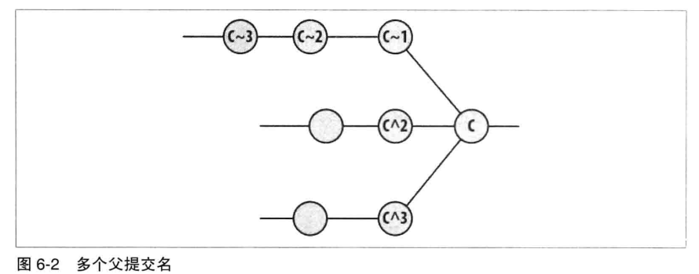
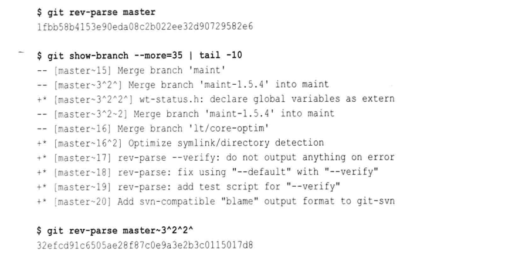
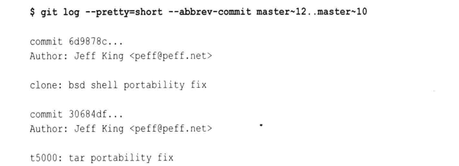
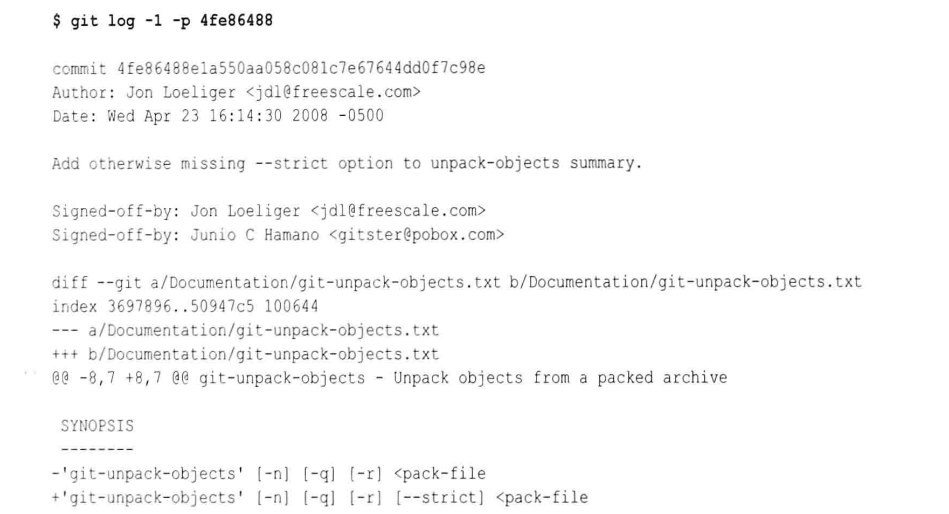
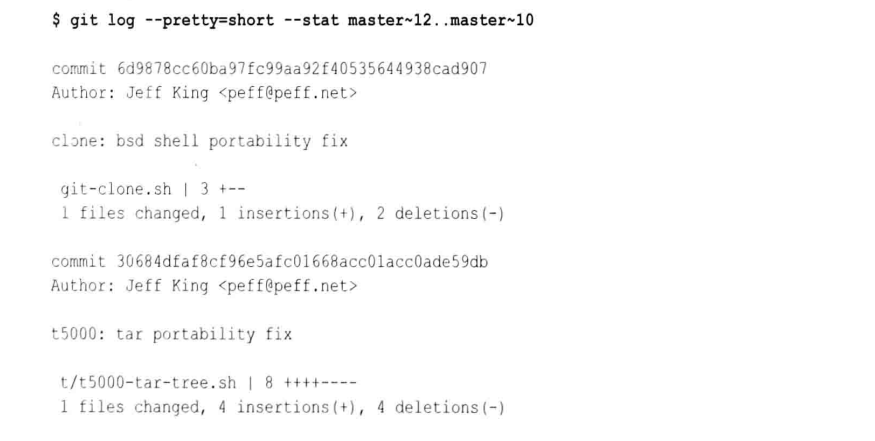
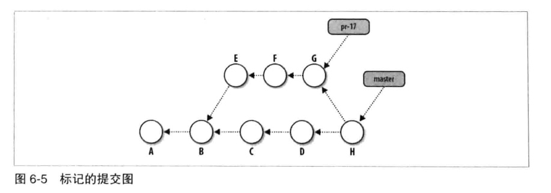
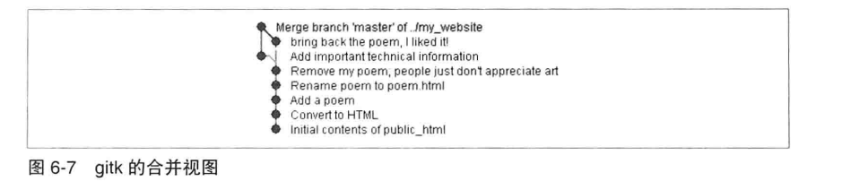
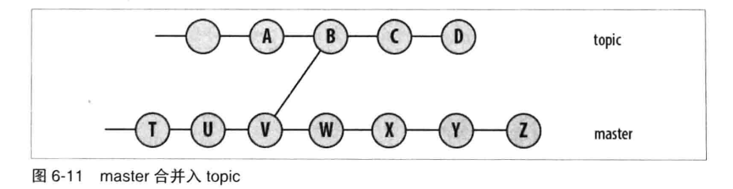
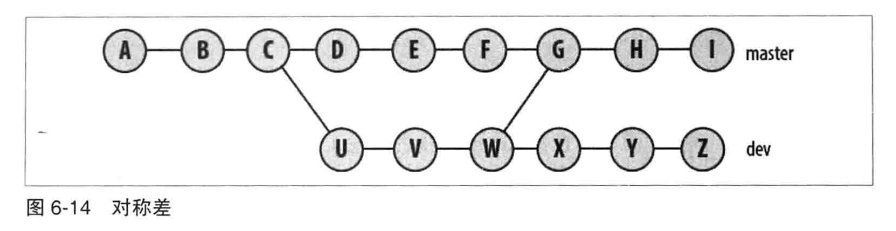

# 第六章: 提交 #

在 Git 中, 提交是用来记录版本库的变更的. 当提交时, Git会记录索引的快照并把快照放进对象库, 快照并不会包含索引中任何文件或目录的副本.
Git 会把当前索引状态和之前的快照做一个比较, 并派生出一个受影响的文件和目录列表. Git 会为有变化的文件创建新的 blob 对象, 对有变化的目录创建新的树对象. 对于未改动的文件和目录则沿用之前的 blob 和树对象.

版本库的变更和提交是一一对应的关系, 提交是将变更引入版本库的唯一方法, 任何版本库中的变更都必须由一个提交引入.

最常见的提交情况是由开发人员引入的, 但是 Git 自身也会引入提交.

## 原子变更集 ##

每一个Git提交都代表一个相对于之前的状态的单个原子变更集. 对于一个提交中所有做过的改动, 要么全部应用, 要么全部不应用.

## 识别提交 ##

在Git中, 可以通过显示或隐式引用来指代每一个提交.

### 绝对提交名 ###

散列ID是个绝对名, 这意味着它只能表示唯一确定的提交, 无论提交处于版本库历史中的任何位置, 哈希ID都对应相同的提交.

由于输入一个40位十六进制的SHA1数字是一项繁琐且容易出错的工作, 因此Git允许使用版本库的对象库中唯一的前缀来缩短这个数字.



### 引用和符号引用 ###

引用(ref) 是一个SHA1值, 指向 Git 对象库中的对象. 一个引用可以指向任何对象, 通常是指向提交对象. 符号引用间接指向 Git 对象, 仍然是一个引用.

本地分支名称, 远程跟踪分支名称和标签等都是引用.

每一个符号引用都有一个以 ref/ 开始的明确名称, 并且分层存储在版本库的 .git/refs 目录中. 该目录基本上有三种不同的命名空间代表不同的引用, refs/heads/ref 代表本地分支, refs/remotes/ref 代表远程分支, refs/tags/ref 代表标签.

可以使用引用的全称或缩写, 如果有一个分支和一个标签使用相同的名字, Git 会根据 git rev-parse 手册上的列表选取第一个匹配项, 通常是:

- .git/ref
- .git/refs/ref
- .git/refs/tags/ref
- .git/refs/heads/ref
- .git/refs/remotes/ref
- .git/refs/remotes/ref/HEAD

Git 自动维护几个用于特定目地的特殊符号引用, 如下:

- HEAD: 始终指向当前分支的最近提交
- ORIG_HEAD: 某些操作(如合并)会把操作前的HEAD记录到该值中
- FETCH_HEAD: git fetch 命令将抓取分支的头记录到 .git/FETCH_HEAD 中
- MERGE_HEAD: 合并操作时, 其他分支的头记录在该值中

所有这些符号引用都可以使用命令 git symbolic-ref 进行管理.

### 相对提交名 ###

除了第一个根提交之外, 每一个提交都来自至少一个比它早的提交, 这其中的直接祖先称为父提交, 若一个提交存在多个父提交, 那么该提交必是由合并操作产生的, 这样的话每一个分支都有一个父提交贡献给合并提交.

在同一代提交中, ^符号用来选择不同的父提交, 例如给定提交C, C^1 是其第一个父提交, C^2 是其第二个父提交, C^3 是其第三个父提交.
~符号用于返回父提交之前选择上一代提交, 例如给定提交C, C~1是一个父提交, C~2是第一个祖父提交, C~3是第一个曾祖父提交. C^1和C~1都指向同一个提交.



Git 支持其他形式的简写和组合, 如 C^和C~ 分别等同于 C^1和C~1, 另外 C^^ 等同于 C^1^1, 也作 C~2.



git rev-parse 命令用于把任何形式的提交名(标签, 相对名, 简写等)转换成对象库中实际的, 绝对的提交散列ID.

## 提交历史记录 ##

### 查看旧提交 ###

显示提交历史记录的主要命令是 git log. 在参数形式上, git log 等价于 git log HEAD, 输出每一个从HEAD找到的历史记录的提交日志消息.

可以在命令中显示历史记录的范围, 例如使用 since..until 这样的形式来指定提交范围.



其中 --pretty=short 选项调整每个提交的信息数量, --abbrev-commit 选项用于缩写散列ID. 可以使用 -p 选项来输出提交引进的补丁或变更:



可以通过 -l 将输出限制为一个提交, 通过 -n 参数将输出限制为最多n个提交.
--stat 选项列举提交中所更改的文件以及每个更改的文件中有多少行做了改动.



可以使用 git show 命令来查看对象库中的对象信息:

```
# 查看某个提交
git show HEAD~2
# 查看 blob 对象
git show origin/master:Makefile
```

### 提交图 ###

Git 使用有向无环图(DAG) 来实现版本库的提交历史记录. 通常约定, 在提交图中每个提交都引入一个树对象来表示整个版本库, 因此一个提交可以只画作一个名字.



#### 使用 gitk 来查看提交图 ####

使用如下命令画出 DAG:

```
gitk
```



### 提交范围 ###

双句点形式用来表示一个范围, 形式为 start..end , 通常提交范围用来检查某个分支或分支的一部分. 范围的定义是从 start开始可达的和从 end开始不可达的一组提交, 即end包含在范围内, start被排除在外.

提交范围也可以使用分支名称, 例如下图中的master分支提交V 合并到 topic分支上的提交B:



范围 topic..master 表示在 master分支而不在 topic 分支的提交, 在上图中表示 W, X ,Y 和 Z.

如果在范围中省略 start 或 end, 那么默认使用 HEAD替代.

三个句点形式表示 A 和 B 之间的对称差, 即 A 或 B 可达但又不是 A 和 B 同时可达的提交集合, A...B 等价于 B...A. 要得到 A...B, 可以执行以下命令:

```
git rev-list A B --not $(git merge-base --all A B)
```

下图为一个对称差示例:



对称差的结果为 (I, H, Z, Y, X, G, F, E, D).

也可以使用以下命令, 选择在 master分支但不再 dev, topic 或 bugfix 分支上的提交:

```
git log ^dev ^topic ^bugfix master
```

## 查找提交 ##

### 使用 git bisect ###

git bisect 一般基于任意搜索条件查找特定的错误提交, 例如某个时刻版本库不能正常工作, 而在之前的某个时间点是可以正常工作的, 这之间包含有多个提交, 此时可以用 git bisect 快速查找具体是哪个提交导致的错误.

git bisect 在好提交和坏提交之间选择一个新提交, 并确定它是好是坏, 并据此缩小范围. 只需在初始时提供一个好提交和一个坏提交, 然后重复回答当前提交是否可以正常工作. 整个查找会在一个分离的HEAD上工作, 即一个匿名分支上.

以下以 Linux 内核为例, 介绍 git bisect 命令的使用:

```
cd linux-2.6
# 启动二分搜索
git bisect start
# 将 HEAD 作为坏提交
git bisect bad
# 将 v2.6.27 作为好提交
git bisect good v2.6.27

# 之后 Git 会检出中间版本, 并由你决定该版本的好坏
# 假设为好
git bisect good
git bisect good

# 假设接下来为坏
git bisect bad

# 重复
git bisect good
git bisect bad

# 查看回答及提交ID
git bisect log
# 可以使用 git bisect replay 命令使用日志文件为输入, 以便重新开始

# 可视化检查提交范围的内容
git bisect visualize --pretty=oneline

# 当完成查找时
git branch
# 回到原来的分支
git bisect reset
```

### 使用 git blame ###

可以使用 git blame 命令来识别一个文件中的每一行最后是谁修改以及哪次提交做出了变更.

```
git blame -L 35, init/version.c
```

### 使用 Pickaxe ###

带有-S 选项的 git log 命令称为 Pickaxe, git log -Sstring 根据给定的 string 沿着文件的差异历史搜索, 找到执行变更的提交:

```
git log -Sinclude --pretty=oneline --abbrev-commit init/version.c
```

显示对文件添加或删除了 include 的行, 但是该提交必须有添加和删除的数量上的变化才能计数.
