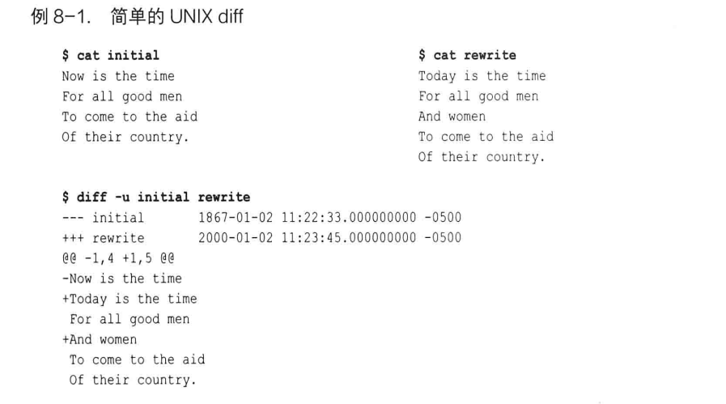
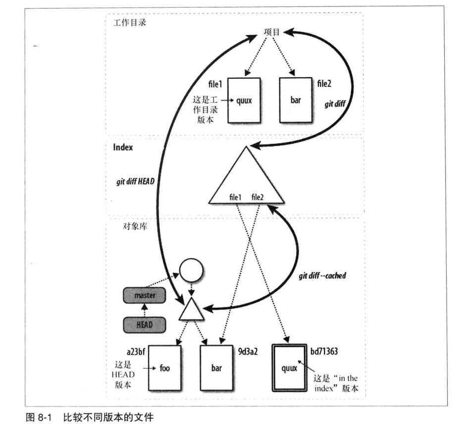
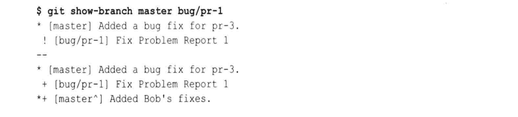
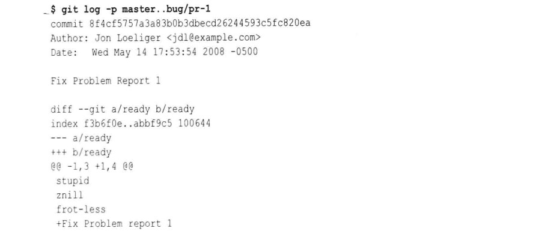
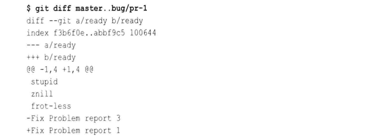
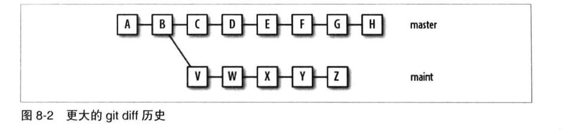
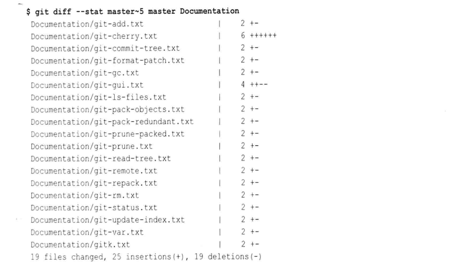

# 第八章: diff #

在 Linux 和 UNIX 系统中, diff 命令会逐行比较两个文本的差异然后显示. 例如如下操作, 比较 initial 和 rewrite 文件的差异:



在 diff 输出的开始部分, 原始文件被 "---" 符号标记, 新文件被 "+++" 符号标记.
@@符号之间表示两个不同文件版本的上下文行号, 其中 -符号表示第一个文件, 1表示第一行, 4表示连续4行, 即下面是第一个文件从第一行开始的连续4行; 后续输出同理.
以 -号开始的行代表从原始文件删除该行以得到新文件, +号表示从原始文件添加该行以产生新文件, 以空格开始的行表示两个版本都有的行, 是由 -u 选项作为上下文提供的.

Git 也有自己的 diff工具, 命令 git diff 一样可以进行文件间的比较.

## git diff 命令的格式 ##

如果对两个不同的根级树对象进行比较, git diff 将会得到这两个项目状态的所有不同. 以下是三个可供树或类树对象使用 git diff 命令的基本来源:

- 整个提交图中的任意树对象
- 工作目录
- 索引

git diff 命令可以使用上述三种来源的组合进行如下 4 种基本比较:

1. git diff

显示工作目录和索引之间的差异, 同时会显示工作目录中什么是脏的, 并把它们作为下个提交暂存的候选.

2. git diff commit

显示工作目录和给定提交间的差异, 常见的用法是用 HEAD 或者一个特定的分支名作为 commit

3. git diff --cached commit

显示索引中的变更和给定提交中的变更之间的差异, commit 默认为 HEAD. 同 --staged 选项.
    
4. git diff commit1 commit2

显示两个提交之间的差异.

下图描述了上述前3中比较的例子:



git diff 常用的选项如下表:

| 选项 | 描述 |
|:--|:--|
| --M | 查找重命名并生成一个简化的输出 |
| -w, --ignore-all-space | 忽略空白字符 |
| --stat | 显示针对两个树状态之间差异的统计数据, 例如多少行修改, 多少行添加, 删除 |
| --color | 使用多种颜色显示 diff 中的变化 |

git diff 命令也可以限定为一组指定文件或目录间的差异.

## 简单的 git diff 例子 ##

利用图 8-1 中的场景, 使用多种 git diff 命令:

首先初始化版本库:

```
# 建立版本库
$ mkdir /tmp/diff_example
$ cd /tmp/diff_example
$ git init

# 初始化文件并提交
$ echo "foo" > file1
$ echo "bar" > file2
$ git add file1 file2
$ git commit -m "Add file1 and file2"
```

然后修改 file1, 查看 git diff 的输出:

```
# 修改 file1
$ echo "quux" > file1

# 查看工作目录和索引的差异
$ git diff
diff --git a/file1 b/file1
index 257cc56..d90bda0 100644
--- a/file1
+++ b/file1
@@ -1 +1 @@
-foo
+quux

# 查看工作目录和 HEAD 的差异
$ git diff HEAD
diff --git a/file1 b/file1
index 257cc56..d90bda0 100644
--- a/file1
+++ b/file1
@@ -1 +1 @@
-foo
+quux

# 查看索引和 HEAD 的差异
$ git diff --cached
```

暂存 file1, 查看 git diff 的输出:

```
# 暂存 file1
$ git add file1

# 查看工作目录和索引的差异
$ git diff

# 查看工作目录和 HEAD 的差异
$ git diff HEAD
diff --git a/file1 b/file1
index 257cc56..d90bda0 100644
--- a/file1
+++ b/file1
@@ -1 +1 @@
-foo
+quux

# 查看索引和 HEAD 的差异
$ git diff --cached
diff --git a/file1 b/file1
index 257cc56..d90bda0 100644
--- a/file1
+++ b/file1
@@ -1 +1 @@
-foo
+quux
```

再次编辑 file1, 查看 git diff 的输出:

```
$ echo "baz" > file1

# 查看工作目录和索引的差异
$ git diff
diff --git a/file1 b/file1
index d90bda0..7601807 100644
--- a/file1
+++ b/file1
@@ -1 +1 @@
-quux
+baz

# 查看工作目录和 HEAD 的差异
$ git diff HEAD
diff --git a/file1 b/file1
index 257cc56..7601807 100644
--- a/file1
+++ b/file1
@@ -1 +1 @@
-foo
+baz


# 查看索引和 HEAD 的差异
$ git diff --cached
diff --git a/file1 b/file1
index 257cc56..d90bda0 100644
--- a/file1
+++ b/file1
@@ -1 +1 @@
-foo
+quux
```

此时进行一次提交:

```
$ git commit -m "quux uber alles"
 
$ git diff HEAD^ HEAD
diff --git a/file1 b/file1
index 257cc56..d90bda0 100644
--- a/file1
+++ b/file1
@@ -1 +1 @@
-foo
+quux

$ git diff
diff --git a/file1 b/file1
index d90bda0..7601807 100644
--- a/file1
+++ b/file1
@@ -1 +1 @@
-quux
+baz
```

可以看到这次提交提交了索引中的版本, 工作目录中的修改没有提交.

## git diff 和提交范围 ##

git diff 命令支持两点语法来显示两个提交之间的不同, 例如下面两条命令是等价的:

```
$ git diff master bug/pr-1
$ git diff master..bug/pr-1
```

但是它的两点语法和 git log 中的用法不同:

- git diff 不关心它比较的文件的历史, 也不关心分支
- git log 特别关注一个文件是如何变成另一个的, 例如当产生分支时在每一个分支上发生了什么

例如, 从 master 分支中创建了一个新分支 bug/pr-1, 并在 bug/pr-1 分支中对某个文件添加了一行 "Fix Problem report 1", 然后在 master 分支中对同样的文件添加一行 "Fix Problem report 3", 然后使用如下命令查看输出:

git show-branch 命令:



git log 命令, 回溯 bug/pr-1 到 master 分支的历史:



git diff 命令, 查看两个分支文件现在状态的差异:



考虑如下更大的 git diff 历史:



在上图中, git log master..maint 会显示5个单独的提交, 即 V,W...Z; 而 git diff master..maint 会显示 H 和 Z 处树之间的差异, 累计 11 个提交, 即 C,D...H 和 V...Z.

同样的, 两条命令都接受 commit1...commit2 这样的参数来产生一个对称差. git log commit1...commit2 显示的是各自可达又不同时可达的提交, 因此 git log master...maint 会输出 C,D...H 和 V...Z; 对称差在 git diff 中会显示 commit2 和 commit1 的共同祖先(或合并基础)之间的差异, 因此 git diff master...maint 会组合 V,W...Z 中的变更.

## 路径限制的 git diff ##

在默认情况下, git diff 会显示从根开始的整个目录结构的差异, 可以使用路径限制来指定输出一个子集:



也可以使用 -S"string" 选项来搜索包含 string 的变更:

```
$ git diff -S"octopus" master~50
```

## 比较 SVN 和 Git 如何产生 diff ##

SVN 只存储文件间的差异, 例如本地版本是 r1095, 服务器版本是 r1123, 当你更新是服务器会把两个版本之间的 diff 发送给你, 并且它会把多个版本的 diff 文件合并为一个更大的 diff 文件.

而在 Git 中, 每个提交都包含一个树, 包含该提交的所有文件列表. Git 的 diff 和 patch 是导出的数据, 因为 Git 存储的是每一个提交的完整内容.
