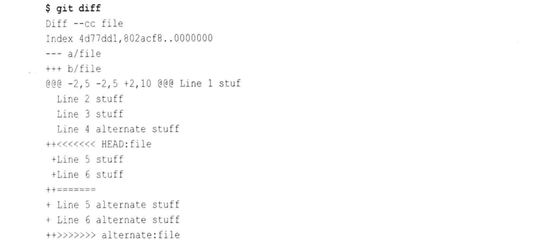
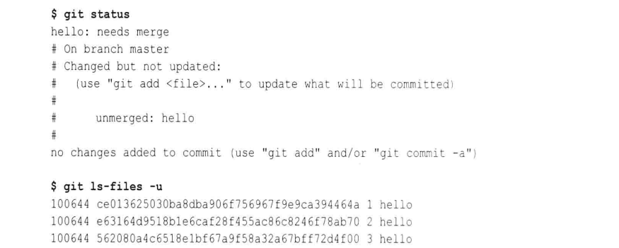
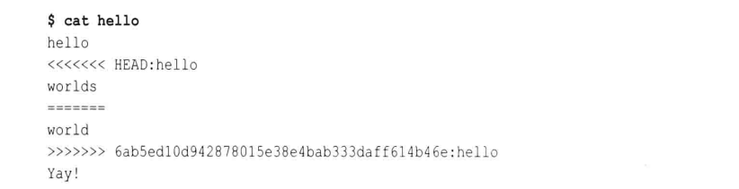
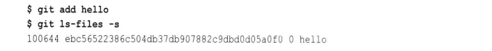
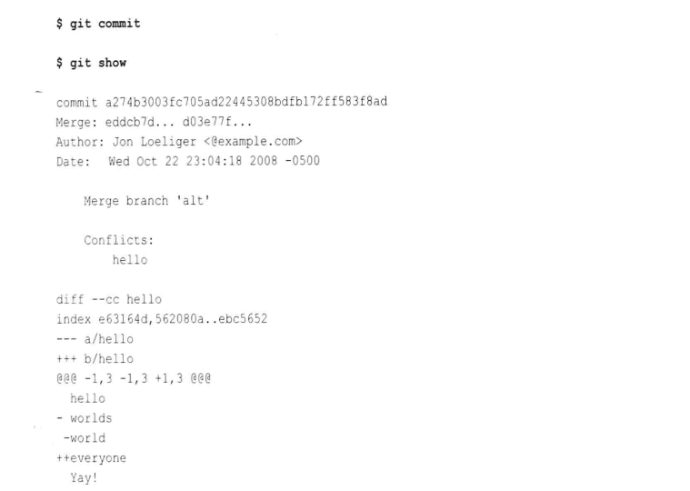
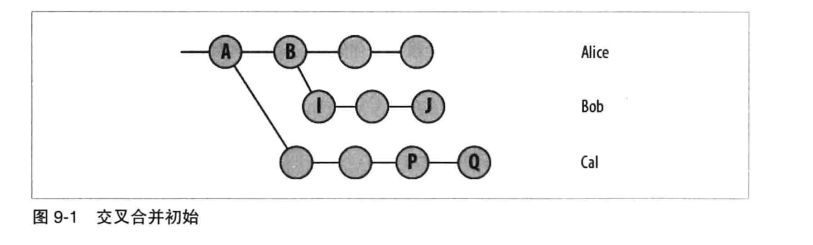
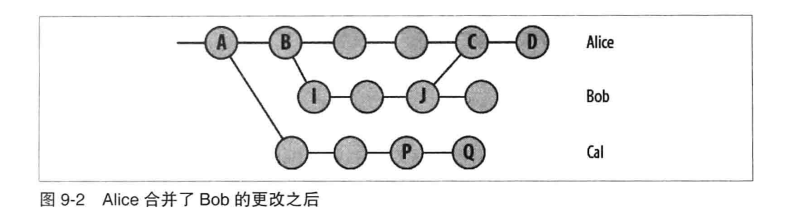
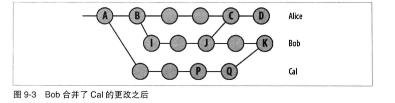
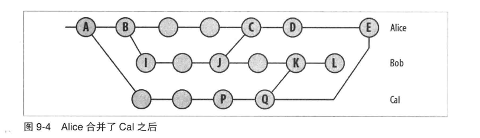
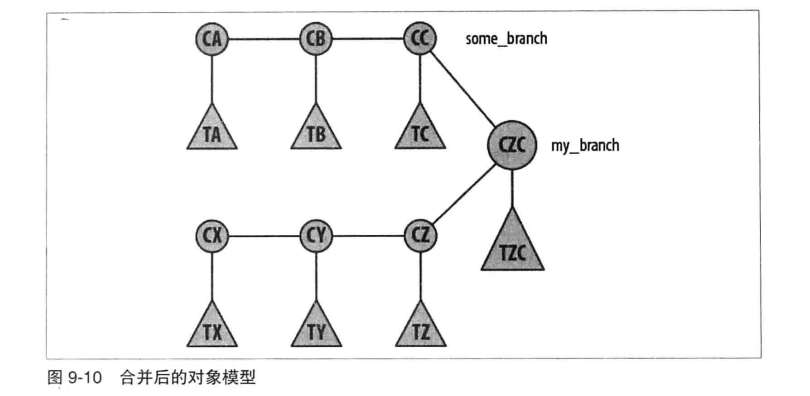

# 第九章: 合并 #

## 合并的例子 ##

可以使用如下的命令把 other_branch 分支合并到 branch 中:

```
$ git checkout branch
$ git merge other_branch branch
```

### 为合并做准备 ###

在正常合并结束的时候, Git 会创建新版本的文件并把它们放到工作目录中, 而且 Git 会使用索引来存储文件的中间版本.
如果已经修改了工作目录中的文件, 或者通过 git add 或 git rm 等修改了索引, 那么版本库中就是一个脏的工作目录或索引, 在这种状态下进行合并 Git 可能无法一次合并所有分支及工作目录或索引的修改.
所以从干净的工作目录和索引进行合并, 会使 Git 的合并更容易.

### 合并两个冲突 ###

下面以一个拥有两个分支的版本库为示例:

首先创建版本库, 并在 master 分支上添加两个提交:

```
$ git init
$ cat > file
Line 1 stuff
Line 2 stuff
Line 3 stuff
^D
$ git add file
$ git commit -m "Initial 3 line file"

# 添加第二个提交
$ cat > other_file
Here is stuff on another file!
^D
$ git add other_file
$ git commit -m "Another file"
```

创建新分支 alternate, 从 master^ 提交派生, 并修改 file 文件:

```
$ git checkout -b alternate master^
$ cat >> file
Line 4 alternate stuff
^D
$ git commit -a -m "Add alternate's line 4"
```

现在使用 git merge 命令进行合并, 在 git merge 命令中, 当前分支始终是目标分支, 会将一个或多个其他分支合并到当前分支.
使用以下命令将 alternate 分支合并到 master 分支:

```
$ git checkout master
$ git merge alternate
```

查看到 git log 的输出如下图:


从上图中可以看到, 两个分支在初始提交 8f4d2d5 处分开; 每个分支有一个提交; 两个分支在提交 1d51b93 处合并.

### 有冲突的合并 ###

以之前的实例为基础, 构造一个包含冲突的合并. 首先, 在 master 分支上修改文件并提交:

```
$ git checkout master
$ cat >> file
Line 5 stuff
Line 6 stuff
^D
$ git commit -a -m "Add line 5 and 6"
```

在 alternate 分支上修改同一个文件:

```
$ git checkout alternate
$ git show-branch
$ cat >> file
Line 5 alternate stuff
Line 6 alternate stuff
^D
$ git commit -a -m "Add alternate line 5 and 6"
```

尝试执行合并操作, 并得到一个冲突的提示:

```
$ git checkout master
$ git merge alternate
```

使用 git diff 查看文件在工作目录和索引之间的差异:



从图上可以看到, 改变的内容显示在 <<<<<<<< 和 ======== 之间, 替代的内容在 ======== 和 >>>>>>>> 之间. 使用文本编辑器修改文件内容如下:

```
$ cat file
Line 1 stuff
Line 2 stuff
Line 3 stuff
Line 4 alternate stuff
Line 5 stuff
Line 6 alternate stuff
```

这时冲突已经解决, 提交文件:

```
$ git add file
$ git commit
```

此处使用 git commit 命令来进行提交, Git 会准备一条模板消息.

## 处理合并冲突 ##

创建另一个合并冲突的场景. 对一个仓库新建两个不同的分支, 各自有不同的文件变体:

```
$ git init
$ echo hello > hello
$ git add hello
$ git commit -m "Initial hello file"
 
$ git checkout -b alt
$ echo world >> hello
$ echo 'Yay!' >> hello
$ git commit -a -m "One world"
 
$ git checkout master
$ echo worlds >> hello
$ echo 'Yay!' >> hello
$ git commit -a -m "All worlds"
```

现在在 master 分支中尝试合并 alt 分支, Git 会提示发生了冲突:

```
$ git merge alt
```

### 定位冲突的文件 ###

Git 会对有问题的文件进行跟踪, 并在索引中把它们标记为冲突的(conflicted) 或者未合并的(unmerged). 可以使用 git status 命令或 git ls-files -u 命令来显示工作树中仍然未合并的一组文件:



也可以使用 git diff 来显示没有合并的内容, 但是该命令也会显示更多的细节.

### 检查冲突 ###

当冲突出现时, 通过三方比较或者合并标记强调工作目录中的每个冲突文件的副本. 例如前例中的冲突文件内容如下:



合并标记划定文件冲突部分的两个副本, 可以简单的选择其中一个, 移除冲突标记然后提交即可. 也可以使用如下的其他方式:

#### 对冲突使用 git diff 命令 ####

Git 有一个特殊的 git diff 变体来同时显示针对两个父版本做的修改:


这只是两个 diff 文件的组合, 一个是称为 HEAD 的父版本, 一个是称为 alt 的父版本, 第二个父版本也有一个特殊的名字: MERGE_HEAD.
git diff 的输出中有两列信息, 第一列显示相对你的版本的更改, 第二列显示相对另一个版本的更改.

也可以拿 HEAD 和 MERGE_HEAD 版本和工作目录(合并的)版本进行比较:

```
$ git diff HEAD                 # 等价于 git diff --ours
$ git diff MERGE_HEAD           # 等价于 git diff --theirs
# 查看自合并基础之后的变更组合
$ git diff --base               # 等价于 git diff $(git merge-base HEAD MERGE_HEAD)
```

可以将文件编辑为如下内容, 使用一个第三版本来解决冲突:

```
hello
worldly ones
Yay!
```

然后使用 git diff 会看到如下输出:


或者选择其中一个版本来解决冲突, 这时 git diff 将不再输出冲突内容, 这是因为当你解决 MERGE_HEAD 版本中的冲突后, Git 会忽略这些差异.

#### 对冲突使用 git log 命令 ####

在解决冲突时, 也可以使用 git log 命令来显示冲突的来源和变更:


此命令将显示这两个部分的历史中的所有提交, 并显示每次提交引入的变更. 选项如下:

- --merge: 只显示和产生冲突的文件相关的提交
- --left-right: 如果提交来自合并的左则显示<(我们的版本), 来自合并的右则显示>(他们的版本)
- -p: 显示提交消息和每个提交相关联的补丁

如果版本库中的冲突太多, 也可以在命令后面指定文件名.

### Git 是如何追踪冲突的 ###

Git 通过以下几个部分来追踪一个合并冲突的所有信息:

- .git/MERGE_HEAD 包含合并进来的提交的 SHA1 值
- .git/MERGE_MSG 包含当解决冲突后执行 git commit 命令时用到的默认合并信息
- Git 的索引包含每个冲突文件的三个副本: 合并基础, 我们的版本和他们的版本, 各自编号1, 2, 3
- 冲突的版本(合并标记和所有内容)不存储在索引中而存储在工作目录中的文件里

可以使用如下命令来查看索引项如何存储:

```
# 可以添加 -u 选项来确认只显示有冲突的文件
$ git ls-files -s
```

可以使用如下命令来查看特定版本的文件:

```
$ git cat-file -p e6316
```

使用如下命令来查看合并基础和需要合并入的版本的区别:

```
$ git diff :1:hello :3:hello
```

### 结束解决冲突 ###

将 hello 文件的内容修改为如下:

```
hello
everyone
Yay!
```

添加索引并查看索引如下图:



在 SHA1 和路径名中间的 0 表示无冲突文件的暂存编号是 0. 执行 git commit 命令并查看提交:



这个提交信息有三个特别的点:

1. 在开头第二行写着 Merge, 每个合并提交通常有几个父提交, 这里会输出每个父提交的 SHA1
2. 自动生成的提交日志信息有助于标注冲突的文件列表
3. 合并提交的差异不是一般的差异, 处于组合差异或冲突合并的格式, 只显示与合并分支不同的地方

### 中止或重新启动合并 ###

在合并提交执行最后的 git commit 之前, 可以使用如下命令来终止或重新启动合并:

```
$ git reset --hard HEAD
```

如果是要在已经结束后放弃, 可以使用如下命令:

```
$ git reset --hard ORIG_HEAD
```

如果需要返回到尝试解决冲突前的原始状态, 可以使用如下命令:

```
$ git checkout -m
```

## 合并策略 ##

下面介绍一个复杂点的情况. 假设有三个人(Alice, Bob, Cal) 在一个代码库的三个分支上工作. 在开始的时候情况可能如下:



然后 Alice 合并了 Bob 的修改, 但是 Bob 没有将 Alice 的变更合并:



然后 Bob 合并了 Cal 的修改:



现在考虑一个复杂的情况: Alice 也要合并 Cal 的最新修改, 产生了提交 E, 但是若 Alice 又要合并 Bob 的修改 L, 那么这次的合并基础(L和E之间) 是什么?



此时的合并基础有多个选择(A, B, J, Q), 但是都不是完全合适. 这种情况称为交叉合并, 因为修改在分支之间来回合并. Git 开发人员设计了可替代, 可配置的合并策略来处理各种不同的合并情况.

### 退化合并 ###

有两种导致合并的常见退化情况, 分别是已经是最新的( already up-to-date )和快进的( fast-forward ). 在这种情况下执行 git merge 不实际引入一个合并提交.

- 已经是最新的

当来自其他分支的所有提交都存在于目标分支上时, 即使它已经在它自己的分支上前进了, 目标分支还是已经更新到最新的, 因此没有新的提交会添加到你的分支上

- 快进的

当分支的 HEAD 已经在其他分支中完全存在或表示时, 就会发生快进合并. 这是 已经是最新的 的反向情形.

### 常规合并 ###

这些合并策略都会产生一个最终提交, 添加到当前分支中, 表示合并的组合状态:

- 解决(Resolve): 解决策略只操作两个分支, 定位共同的祖先作为合并基础, 然后执行一个直接的三方合并, 对当前分支施加从合并基础到其他分支的 HEAD 的变化.
- 递归(Recursive): 和解决策略相似, 但是能处理有多个合并基础的情况. 当有多个合并基础时, Git 会生成一个临时合并来包含所有相同的合并基础, 然后以此为基础通过一个普通的三方合并算法导出两个给定分支的最终合并.
- 章鱼(Octopus): 专为两个以上分支的合并而设计. 在内部多次调用递归合并策略, 为要合并的每个分支调用一次. 不能处理需要用户交互解决的冲突, 在这种情况下必须做一系列常规合并, 一次解决一个冲突.

1. 递归合并策略

一个例子如下图:


对于分支 A 和 B, 节点 a 和节点 b 都是他们的合并基础. 递归策略会把 a 和  b 合并到一个临时基础中, 并以它作为合并基础. 因为 a 和 b 可能有相同的问题, 所以需要递归处理.

2. 章鱼合并策略

Git 支持一次合并多个分支, 允许灵活的父提交列表, 章鱼策略是这种通用性设计决策的自然结果.

### 特殊提交 ###

有两个特殊的策略: 我们的( ours ) 和子树( subtree ). 它们都会产生一个最终提交, 并添加到当前分支中.

- 我们的

合并任何数量的其他分支, 但只是用当前分支的文件. 合并结果和 HEAD 是相同的, 只是把其他分支也记为父提交. 通常用于已经拥有其他分支的变化, 只是想要合并两个历史.

- 子树

合并到另一个分支, 但是那个分支的一切会合并到当前树的一颗特定子树, Git 会自动决定使用哪颗子树.

### 应用合并策略 ###

Git 会尝试使用尽可能简单和廉价的算法. 它会首先尝试使用已经是最新的和快进策略, 对于多个分支合并, 只能选择章鱼策略.
如果这些都失败了, 那么会选择一个默认策略, 现在是递归合并策略, 以前是 resolve 策略. 如果想要使用 resolve 策略, 可以使用如下的类似命令:

```
$ git merge -s resolve Bob
```

默认的递归合并策略工作如下:

1. 从 Alice 和 Bob 都有的 Cal 最新版本开始, 即节点 Q
2. 计算 Q 和 Alice 从 Bob 合并来的版本的差异, 然后打上补丁
3. 计算合并版本和 Bob 最新版本的差异, 然后打上补丁

可以一起使用两个合并策略, 例如将 gitweb 程序的整个历史合并到 git.git 的 gitweb 子树下:

```
# 将 gitweb 项目的当前文件复制到 git项目下的 gitweb 目录
# 提交 gitweb 目录
# 使用 ours 策略
$ git pull -s ours gitweb.git master
# 使用 subtree 策略提取最新修改
$ git pull -s subtree gitweb.git master
```

### 合并驱动程序 ###

一个合并驱动程序接受三个临时文件名来代表共同祖先, 目标分支版本和文件的其他分支版本, 驱动程序通过修改目标分支来得到合并结果.

1. 文本合并驱动程序留下三方合并的标志
2. 二进制合并驱动程序简单的保留文件的目标分支版本, 在索引中把文件标记为冲突的. 这使你手动处理二进制文件
3. 联合合并驱动程序只是简单的把两个版本的所有行留在合并后的文件里

## Git 怎么看待合并 ##

### 合并和 Git 的对象模型 ###

Git 在合并时产生一个新的树对象, 该树对象包含合并后的文件, 但它只在目标分支上引入一个新的提交对象. 例如经过如下命令后的对象图:

```
$ git checkout my_branch
$ git merge some_branch
```



### 压制合并 ###

假设被合并的分支有多个提交, 在大多数系统中将该提交合并到目标分支会产生一个差异, 然后把这个差异应用到目标分支产生一个提交, 这就是压制提交. 在压制提交中被合并分支的提交历史将丢失.

而在 Git 中, Git 会保留所有分支的提交历史.

### 为什么不一个接一个地合并每个变更 ###

如果将被合并分支的提交一个一个的应用在目标分支上, 那么就会创建一系列新的版本, 但这会违反一个原则: 历史记录中的每个版本都应是真实的.
