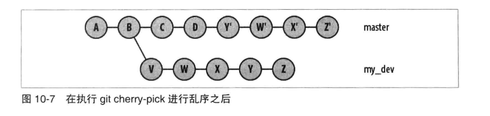

# 第十章: 更改提交 #

## 关于修改历史记录的注意事项 ##

作为一般原则, 如果一个分支已经公开, 并且可能存在于其他版本库中, 那就不应该重写, 修改或更改该分支的任何部分.

## 使用 git reset ##

git reset 调整 HEAD 引用指向给定的提交, 默认情况下还会更新索引以匹配该提交. git reset 命令也可以修改工作目录以呈现给定提交代表的项目修订版本.

git reset 命令的主要选项如下表:

| 选项 | 作用 |
|:--|:--|
| --soft | 将HEAD引用指向给定提交, 索引和工作目录保持不变. |
| --mixed | 将HEAD指向给定提交, 索引内容也修改为符合给定提交的树结构, 默认模式 |
| --hard | 将HEAD指向给定提交, 索引和工作目录也修改为符合给定提交的内容 |

git reset 命令把原始 HEAD 值保存在 ORIG_HEAD 中. 下面是一个意外暂存了 foo.c 文件, 需要恢复的例子:

```
# 意外暂存文件 foo.c
$ git add foo.c

# 显示暂存列表
$ git ls-files
foo.c
main.c

# 删除暂存的 foo.c
$ git reset HEAD foo.c

$ git ls-files
main.c
```

git reset 的另一个常见的用法是简单的重做或清除分支上的最近提交. 下面建立一个有两个分支的仓库作为例子:

```
# 初始化仓库, 并在 master 分支上建立两个提交
$ git init
$ echo foo >> master_file
$ git add master_file
$ git commit -m "Add master_file to master branch"
$ echo "more foo" >> master_file
$ git commit -m "Add more foo"
$ git show branch --more=5
```

然后撤销第二个提交, 但是保存工作目录文件内容:

```
$ git reset HEAD^
$ cat master_file
foo
more foo
```

然后修改文件并重新索引, 提交:

```
$ echo "even more foo" >> master_file
$ git commit -m "Updated foo" master_file
```

然后调整提交信息:

```
$ git reset --soft HEAD^
$ git commit -m ""
```

--soft 选项只是将 HEAD 调整位置, 但保持索引和工作目录不变, 这样就有机会通过重新提交来修改提交信息.

假设要完全取消第二次提交, 可以使用如下命令:

```
$ git reset --hard HEAD^
$ cat master_file
foo
```

为了演示对其他分支使用 git reset, 现在添加一个新分支 dev:

```
$ git checkout master
$ git checkout -b dev
$ echo bar >> dev_file
$ git add dev_file
$ git commit -m "Add dev_file o dev branch"
```

然后在 master 分支上使用 git reset 命令:

```
$ git checkout master
$ git reset --soft dev
```

此时会有一个非常特殊的状态, 即 HEAD 指向的提交有个 dev_file 文件, 但是这个文件不在 master 分支上, 然后在 master 分支上构建一个提交:


Git 正确的添加了新文件 new, 但是却显示删除了文件 dev_file. 这是因为该文件确实不存在于 master 分支, 因为它从来没有存在过. 为什么 Git 选择删除这个文件呢? 这是因为执行提交时 HEAD 的指向中有这个文件:


可以看出, 最后一次提交是错误的, 应该删除. 但是此时不能使用 git reset --hard HEAD^, 但是这时 HEAD^ 是指向的 dev 分支的HEAD, 而不是 master 分支的 HEAD, 所以也是不正确的状态.
有几个办法可以确认 master 分支应该重置到哪个提交, 例如使用 git log 命令:


或者使用 reglog 来查看版本库中引用变化的历史记录:


通过以上方式可以确认, e719b1f 或者 HEAD@{2} 是可以恢复到正确状态的提交:

```
$ git rev-parse HEAD@{2}
$ git reset --hard HEAD@{2}
$ git show-branch
```

## 使用 git cherry-pick ##

git cherry-pick 命令会在当前分支上应用给定提交引入的变更, 即引入一个新的独特提交, 并添加历史记录. 通常用于把版本库中一个分支的特定提交引入一个不同的分支, 常见用法是把维护分支的提交移植到开发分支.

假设如下图, 在 dev 分支上进行正常开发, 而 rel\_2.3 包含2.3版本维护的提交. 现在在 dev 分支上的提交 F 修复了一个BUG, 并且需要应用到 rel\_2.3 分支:


使用命令如下:

```
$ git checkout rel_2.3
$ git cherry-pick dev~2
```

从图中可以看到, rel_2.3 分支添加了一个提交 F'.

git cherry-pick 的另一个常见用途是重建一系列提交, 通过从一个分支选择一批提交, 然后把它引入另一个分支. 假设如下图, 需要将 my_dev 分支上的提交引入 master 分支, 但是打乱顺序:



使用的命令如下:

```
$ git checkout master
$ git cherry-pick my_dev^
$ git cherry-pick my_dev~3
$ git cherry-pick my_dev~2
$ git cherry-pick my_dev
```

在 git cherry-pick 命令中, 也可以应用一个范围的提交:

```
$ git cherry-pick X..Z
```

## 使用 git revert ##

git revert 应用给定提交的逆过程, 用于引入一个新提交来抵消给定提交的影响.

例如执行以下命令, 撤销提交 D 得到的结果如图:

```
$ git revert master~3
```


## reset, revert 和 checkout ##

有一些规则和指引, 指明 reset, revert, checkout 命令应在何时使用:

- 如果想切换到不同的分支, 使用 checkout, checkout 命令也可以检出文件然后放到工作目录中
- reset 命令会重置当前分支的 HEAD 引用
- revert 命令作用于全部提交, 而不是文件

## 修改最新提交 ##

使用 git commit --amend 来修改当前分支最近一次提交, 常用用途shi在刚做出一个提交之后修改录入错误. 假设提交了一个内容如下图:


如果此时发现一个错误, 你可以简单的修改文件然后做出一个提交, 这样将留下两个提交记录. 如果你不想引入新的提交, 可以执行如下命令:

```
$ git add speech.txt
$ git commit --amend
```

然后新的修改将修改原始提交. 也可以使用如下命令来修改提交作者:

```
$ git commit --amend --author "xxx"
```

## 变基提交 ##

git rebase 命令是用来改变一串提交以什么为基础的, 不在目标分支中的当前分支提交会变基. 常见用途是保持你正在开发的一系列提交相对于另一个分支是最新的.
例如在下图中, 有两个分支: master 和 topic. topic 分支是以 master 分支的提交 B 为基础的:


可以使用如下命令让 topic 的提交基于提交 E :

```
$ git checkout topic
$ git rabase master
# 或者
$ git rebase master topic
```

执行命令之后如图:


在这种情况下, 使用 git rebase 命令称为向前移植(forward porting), 在本例中分支 topic 已经向前移植到了 master 分支.

git rebase 命令也可以用 --onto 选项把一条分支上的开发线整个移植到完全不同的分支上. 例如假设在 feature 分支上开发了一个新功能, 需要将提交迁移到 master 分支, 迁移之前如下图:


使用如下命令进行迁移:

```
$ git rebase --onto master maint^ feature
```

执行迁移之后如下图:


变基操作一次只迁移一个提交, 从各自原始提交位置迁移到新的提交基础, 每个提交都可能有冲突需要解决. 如果发现冲突, rebase 操作会挂起以便你解决冲突. 这时你可以采用以下操作:

- git rebase --continue: 在解决冲突并更新索引之后恢复变基操作, 处理下一个提交
- git rebase --skip: 跳过这个提交并移动到下一个提交
- git rebase --abort: 中止操作, 并把版本库恢复到发出 git rebase 命令之前的状态

### 使用 git rebase -i ###

git rebase 命令的 -i 或者 --interactive 选项可以重新排序, 编辑, 删除, 把多个提交合并为一个, 把多个提交分离成多个. 这个命令允许你修改一个分支的大小, 然后把它们放回原来的分支或不同的分支.

假设你有如下图的提交历史:


首先你想把它修改为如下图的历史:


可以执行如下命令:

```
$ git rebase -i master~3
```

然后编辑一个如下图的文件:


前三行列出在命令行里指定的可编辑提交范围内的提交, 并按照从最老到最新排序. 现在交换第1行和第2行的顺序, 然后退出编辑器. 这时每个提交都会按照顺序应用到目标分支. 得到的提交历史如下图:


下一步是把两个拼写提交合并为一个. 再一次使用 git rebase -i master~3 命令, 将提交内容编辑为如下图:


第三次提交会合并到前一个提交中, 新的提交信息模板会把两个提交组合起来. 如下图:


可以编辑这些内容作为新的提交信息, 得到如下图的历史:


### 变基和合并 ###

变基一系列提交的过程会导致 Git 生成一系列全新的提交, 它们有新的 SHA1 提交 ID, 基于新的初始状态, 代表不同的差异. 考虑如下图的提交:


执行如下命令:

```
$ git rebase master dev
```

得到如下图的提交:


提交 X', Y' 和 Z' 是起源于 B 的旧提交的新版本, 而提交 X 和 Y 还在提交图中, 因为它们还是从 dev2 分支可达的, 然后 Z 提交不再可达所以被删除了.
如果你希望把 dev2 分支也进行移动, 那么可以执行如下命令, 将 dev2 分支变基到提交 Y':

```
$ git rebase dev^ dev2
```

得到如下图的提交:


对有合并的分支进行变基也容易出现混乱的情况. 考虑如下图的提交:


如果你希望把整个 dev 分支变基到提交 D, 得到如下图的提交:


而实际得到的提交如下图:


因为 Git 需要把提交图中 dev 分支可达的部分移动回合并基础 B, 所以它在 master...dev 范围内寻找提交, 并进行拓扑排序, 产生该范围内的所有提交的一个线性排列并引用到提交 D.
在这种情况下, 如果你想要保留被变基的整个分支的分支与合并结构, 就需要使用 --preserve-merges 选项, 命令如下:

```
$ git rebase --preserve-merges master dev
```

使用变基时需要记住以下概念:

- 变基把提交重写为新提交
- 不可达的旧提交将被删除
- 任何旧的, 变基前的提交的用户可能被困住
- 如果你有个分支用变基前的提交, 你可能需要对它变基
- 如果有个用户有不同版本库中变基前的提交, 即使它已经移动到了你的版本库中, 他仍然拥有该提交的副本; 该用户现在必须也修复他的提交历史记录
