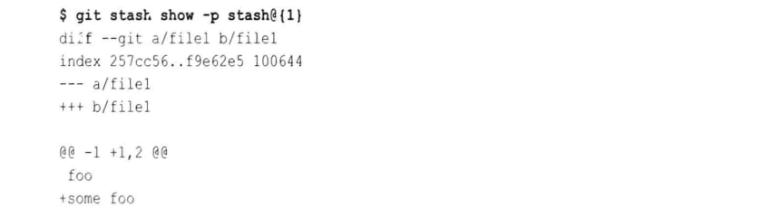
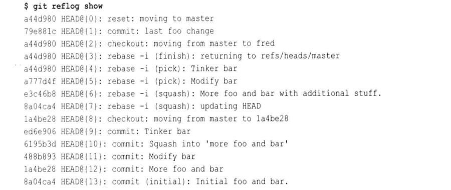
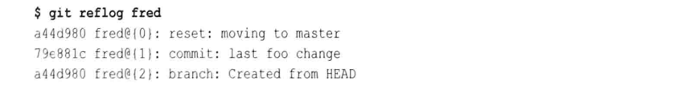
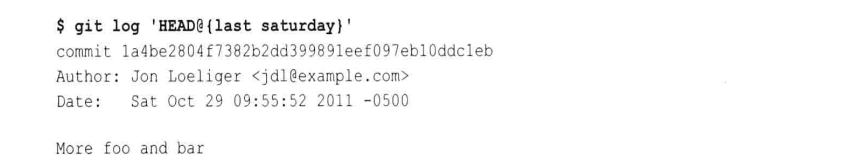

# 第十一章: 储藏和引用日志 #

## 储藏 ##

储藏可以捕获你的工作进度, 允许你保存工作进度并且当你方便时再回到工作进度. 它让你仅通过一条简单的命令就全面彻底的捕获工作目录和索引, 使你的版本库是干净的. 另一条简单的命令可以完全还原工作目录和索引, 让你回到你离开时的状态.

假设一个如下的场景, 你正在 Git 版本库中工作, 修改了一些文件并甚至暂存了一些到索引中. 突然你发现了一个严重的 BUG 需要马上修复, 这时你必须储藏一切然后重新开始, 可以使用如下的命令:

```
$ cd the-git-project
# 进行很多编辑

# 然后此时需要中断编辑
$ git stash save

# 修复 BUG, 然后提交
$ git commit -m "Fixed High-Priority issue"

# 恢复之前的工作状态
$ git stash pop
```

在保存储藏时可以提供一条默认日志消息, 例如:

```
$ git stash save "WIP: Doing real work on my stuff"
```

git stash save 命令将保存当前索引和工作目录的状态, 并且会将之清除以便再次匹配当前分支的头. 索引和工作目录的内容实际上另存为独立且正常的提交, 并且可以通过 refs/stash 来查询:

```
$ git show-branch stash
```

git stash pop 命令将在当前工作目录和索引中还原最近一次 save 操作的内容, pop 操作会取出储藏的内容并合并这些变更到当前状态, 而不仅仅是覆盖或替换文件. 只能在干净的工作目录中使用 git stash pop 命令.

在一个 pop 操作成功后, Git 会自动将储藏状态栈中保存的状态删除, 一旦应用之后储藏的状态将会丢弃. 当需要解决冲突时, Git 将不会自动丢弃状态, 一旦你清理了合并冲突并希望继续, 可以使用 git stash drop 来将状态从储藏栈中删除.

如果你只是想重新创建一个已经保存在储藏状态中的上下文, 又不想把它从栈中删除, 那么可以使用 git stash apply 命令. 因此 pop 命令就是在一个成功的 apply 后面跟着一个 drop.

git stash list 命令按保存时间由近及远的顺序列举出储藏栈:


Git 会将最新添加的储藏条目编号为 0, 随着条目的添加它的编号会递增.

git stash show 命令可以显示给定储藏条目相对于它的父提交的索引和文件变更记录, 加上 -p 参数可以输出更详细的信息.



如果你有新的未提交文件是你本地开发的一部分, 那么一个 git pull 操作可能会引入一个同名的文件从而导致拉取失败, 在这种情况下可以在 git stash 命令后添加 --include-untracked 参数以便它储藏新的未被追踪的文件以及余下的修改, 这将确保在拉取时工作目录是完全干净的.

--all 选项将收集所有的未追踪文件以及在 .gitignore 和 exclude 文件中明确忽略的文件. 对于更复杂的储藏操作, 可以使用 -p 或者 -patch 选项来选择性的选取希望储藏的部分.

有时你储藏的变更会导致你的分支上出现一个全新的开发序列, 而且还原储藏时的合并冲突可能会导致弹出操作难以进行. 在这种情况下, 可以使用 git stash branch 命令来帮助你, 这条命令基于储藏条目生成时的提交, 会将保存的储藏内容转换到一个新的分支.

使用 git stash branch 时需要注意几点:

1. git stash branch 命令创建的分支会基于在储藏栈中的第一个储藏的父提交, 而不是当前的 HEAD
2. 因为储藏始终会对原始提交进行重组, 所以始终会成功并从储藏栈中丢弃它
3. 重组的储藏状态不会自动提交任何变更到新的分支, 所有的储藏文件中的修改都还留在新建并检出的分支上的工作目录中

创建储藏的能力可能很有吸引力, 但是要注意, 不能滥用而创建太多的储藏, 也不要将它们转化成命令的分支来使它们留在版本库中.

## 引用日志 ##

引用日志记录非裸版本库中分支头的改变, 每次对引用的更新, 包括对 HEAD 的引用, 引用日志都会更新以记录这些引用发生了哪些变化. 会更新引用日志的基本操作包括:

- 复制
- 推送
- 执行新提交
- 修改或创建分支
- 变基操作
- 重置操作

从根本上说, 任何修改引用或更改分支头的 Git 操作都会记录. 默认情况下, 引用日志在非裸版本库中是启用的, 在裸版本库中是禁用的. 引用日志是由配置选项 core.logAllRefUpdates 控制的, 可以通过 git config 命令来修改该配置.

可以通过 git reflog show 命令来显示引用日志:



引用日志记录所有引用的事物处理, 但是 git reflog show 命令一次只显示一个引用的事务, 默认显示的是 HEAD. 可以通过如下命令显示 fred 分支的变化:



Git 还支持更多类英语的限定符在花括号中作为引用的一部分:



Git 针对引用支持大量基于日期的限定符, 包括 yesterday, noon, midnight, tea, 星期, 月份等. Git 会时不时的自动执行垃圾回收进程, 在这个过程中, 一些老旧的引用日志条目会过期并被丢弃. 通常情况下, 一个提交如果不能从某个分支或引用指向, 也不可达, 将会默认在 30 天后过期; 可达的提交将默认在 90 天后过期.
可以通过设置配置变量 gc.reflogExpireUnreachable 和 gc.reflogExpire 的值来满足要求. 可以使用 git reflog delete 命令来删除单个条目, 或使用 git reflog expire 命令直接让条目过期并被立即删除.

事实上, 储藏正是通过使用 stash 引用的引用日志来实现的. 引用日志都存储在 .git/logs 目录下, .git/logs/refs 目录包含所有引用的历史记录, .git/logs/refs/heads 包含分支头的历史记录.
