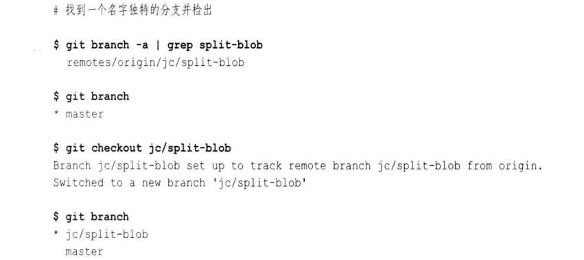

# 第十二章: 远程版本库 #

一个克隆是版本库的副本, 包含所有的原始对象; 远程版本库是一个引用或句柄, 通过文件系统或网络指向另一个版本库; Git 使用远程追踪分支来跟踪其他版本库中的数据.

## 版本库概念 ##

### 裸版本库和开发版本库 ###

开发版本库用于常规的日常开发, 它保持当前分支的概念, 并且在工作目录中提供检出当前分支的副本. 一个裸版本库没有工作目录, 并且不应该用于日常开发, 也没有检出分支的概念. 其他开发人员从裸版本库中克隆和抓取, 并推送更新. 如果你使用带 --bare 选项的 git clone 命令, Git 会创建一个裸版本库.

如果你要创建一个版本库供开发人员推送修改, 那么它应该是裸版本库.

### 版本库克隆 ###

git clone 命令会创建一个新的 Git 版本库, 它并不会复制原始版本库的所有信息, 并且会忽略只跟原始版本库相关的信息(例如远程追踪分支). 原始版本库的标签会被复制到克隆版本库中, 但是原始版本库的特定信息, 例如钩子, 配置文件, 引用日志和储藏不在克隆中重现.

默认情况下, 每个克隆版本库都通过一个名为 origin 的远程版本库, 建立一个链接指回它的父版本库, 并且这是一个单向关系. 如果你想使用其他名称, 只需要在克隆操作中通过 --origin 选项指定替代名称.

Git 还用默认的 fetch refspec 配置默认的 origin 远程版本库:

```
fetch = +refs/heads/*:refs/remotes/origin/*
```

建立这个 refspec 预示你要通过原始版本库中抓取变更来持续更新本地版本库, 远程版本库的分支在克隆版本库中是可用的, 只需要在分支名称前加上 origin/ 前缀, 例如 origin/master .

### 远程版本库 ###

Git 使用远程版本库和远程追踪分支来引用同一个版本库, 并有助于与该版本库建立连接. 使用 git config 命令创建, 删除, 操作和查看远程版本库, 你引入的所有远程版本库都记录在 .git/config 文件中, 可以用 git config 来操作.

常见的与远程版本库有关的命令有:

```
# 从远程版本库抓取对象及其相关的元数据
$ git fetch
# 类似与 fetch, 但合并修改到相应的本地分支
$ git pull
# 转移对象及其相关的元数据到远程版本库
$ git push
# 显示一个给定的远程版本库的引用列表, 间接的返回是否有更新
$ git ls-remote
```

### 追踪分支 ###

分支可以进一步分为以下类别:

- 远程追踪分支(remote-tracking branch): 与远程版本库关联, 专门用来追踪远程版本库中每个分支的变化
- 本地追踪分支(local-tracking branch): 与远程追踪分支配对, 是一种集成分支, 用于收集本地开发和远程追踪分支中的变更
- 特性(topic)或开发(development)分支: 任何本地的非追踪分支
- 远程分支(remote branch): 设在非本地的远程版本库的分支, 可能是远程追踪分支的上游源

在克隆操作过程中, Git 会创建一个远程追踪分支并作为每个主题分支在上游版本库的克隆. 远程追踪分支在专门用于远程克隆的本地版本库中引入一个新的, 单独的命名空间, 它们不是远程版本库中的分支.

本地特性分支实际在 refs/heads/ 命令空间中, 远程追踪分支保留在 refs/remotes/ 命名空间中.

## 引用其他版本库 ##

一个远程版本库是指存在版本库配置文件中的一个实体名, 由两个不同的部分组成: 第一部分以 URL 的形式指出其他版本库的名称; 第二部分称为 refspec, 指定一个引用(通常表示一个分支)是如何从一个版本库的命名空间映射到其他版本库的命令空间.

### 引用远程版本库 ###

Git 支持多种的 URL, 来指定访问协议和数据的位置或地址. Git 的 URL 形式不完全符合 RFC1738 和 RFC2396 的定义, 通常称为 Git URL, 而且在 .git/config 文件中也使用 Git URL.

Git URL 可以是如下的几种形式:

1. 指代本地文件系统上的版本库

可以是本地的物理文件系统, 或是通过 NFS 挂载到本地的虚拟文件系统, 形式如下:

```
/path/to/repo.git
file://path/to/repo.git
```

两者的形式相似, 但是第一种使用文件系统中的硬链接来共享对象, 后者直接复制对象. 通常建议使用第二种形式.

2. Git 原生协议

Git 原生协议是指 Git 内部用来传输数据的自定义协议, 形式如下:

```
git://example.com/path/to/repo.git
git://example.com/~user/path/to/repo.git
```

使用这些格式的客户端不用经过身份验证, 不要求输入密码. ~user 格式可以用来指代用户的主目录, 并且只有当服务器端使用 --user-path 选项允许时 ~user 格式才有效.

3. ssh 协议

对经过身份验证的安全链接, 可以使用如下形式:

```
ssh://[user@]example.com[:port]/path/to/repo.git
ssh://[user@]example.com/path/to/repo.git
ssh://[user@]example.com/~user2/path/to/repo.git
ssh://[user@]example.com/~/path/to/repo.git
```

第三种形式允许存在两个不同的用户名, 第一个是验证会话的用户, 第二个是访问目录的用户.

4. scp URL

形式类似于 SSH 形式, 但无法指定端口参数:

```
[user@]example.com/path/to/repo.git
[user@]example.com:~user/path/to/repo.git
[user@]example.com:path/to/repo.git
```

5. HTTP/HTTPS 协议

```
http://example.com/path/to/repo.git
https://example.com/path/to/repo.git
```

需要注意的是, 大多数企业的防火墙允许 HTTP 的 80 端口和 HTTPS 的 443 端口, 而 Git 默认的 9418 端口通常是关闭的.

6. Rsync 协议

```
rsync://example.com/path/to/repo.git
```

不鼓励使用.

### refspec ###

refspec 把远程版本库中的分支名映射到本地版本库的分支名. 因为 refspec 必须同时从本地版本库和远程版本库指定分支, 所以完整的分支名在 refspec 中是很常见且必须的. 通常开发分支名有 refs/heads/ 前缀, 远程追踪分支名有 refs/remotes/ 前缀.

refspec 的语法如下:

```
[+]source:destination
```

主要由源引用, 冒号和目标引用组成, 完整的格式还有一个可选的加号, 有加号表示不会在传输过程中进行正常的快进安全检查, 星号运行用有限形式的通配符匹配分支名.

在某些应用中, 源引用是可选的; 在另一些应用中, 冒号和目标引用是可选的.

源和目标依赖于正在执行的 Git 操作, 关系总结于下表:

| 操作 | 源 | 目标 |
|:--|:--|:--|
| push | 推送的本地引用 | 更新的远程引用 |
| fetch | 抓取的远程引用 | 更新的本地引用 |

典型的 git fetch 命令会如下使用 refspec:

```
+refs/heads/*:refs/remotes/remote/*
```

此处的 refspec 解释如下:

> 在命名空间的 refs/heads/ 中来自远程版本库的所有源分支(i)映射到本地版本库, 使用远程版本库名来构造名字(ii), 并放在 refs/remotes/remote/ 命名空间中.

惯例是将给定的远程版本库分支放在 refs/remotes/remote/* 下. 可以使用 git show-ref 列出当前版本库中的引用, 使用 git ls-remote 列出远程版本库的引用.

在典型的 git push 命令中, 会把你的版本库中的源分支发送到远程版本库, 使用的 refspec 如下:

```
+refs/heads/*:refs/heads/*
```

如果命令中没有指定远程版本库, 则默认使用 origin; 如果没有 refspec, 则将提交发送到远程版本库中你与上游版本库共有的所有分支.

默认的 refspec 使用以下两条等价的命令:

```
git push origin branch
git push origin branch:refs/heads/branch
```

## 使用远程版本库的示例 ##

一般会建立一个所有的开发人员都认为是权威的一个版本库, 所有人都一致对待该版本库, 这个版本库会存放在一个特殊的目录中, 该目录称为仓库(depot). 仓库会使所有开发人员的 remote origin.

### 创建权威版本库 ###

第一步是用一个初始版本库填充 /tmp/Depot, 假设在 ~/public_html 下已经是 Git 版本库的网站内容, 那么使用以下命令复制内容:

```
$ cd /tmp/Depot
$ git clone --bare ~/public_html public_html.git
```

clone 命令把 ~/public_html 中的 Git 远程版本库复制到当前工作目录 /tmp/Depot 下. 最后一个参数给版本库赋予了一个新的名字. 按照惯例, 裸版本库名有个 .git 后缀.

原始的开发版本库的内容如下:


裸版本库中没有工作目录, 内容如下:


因为在克隆操作过程中使用了 --bare 选项, 所以 Git 没有引入一般默认的 origin 远程版本库. 裸版本库的配置如下:


### 制作你自己的 origin 远程版本库 ###

版本库 ~/public_html 是通过 git init 创建的, 所以它没有 origin, 需要我们手动添加. 操作远程版本库的命令是 git remote, 这个操作会在 .git/config 文件中引入一些新设置. 执行的命令如下:

```
$ git remote add origin /tmp/Depot/public_html
$ cat .git/config
```


git remote 命令在配置中增加了一个名为 origin 的 remote 区段, 其中包含远程版本库的 url 和 refspec.

现在可以在原始版本库中创建新的远程追踪分支, 代表来自远程版本库的分支, 已完成建立 origin 远程版本库的进程.

```
# 列出所有分支, 此时只有 master 分支
$ git branch -a
* master

# 更新远程版本库信息
$ git remote update
$ git branch -a
* master
remotes/origin/master
```

Git 在版本库中引入了一个新的分支 origin/master, 这是一个 origin 远程版本库的远程追踪分支. 它的目的是掌握和追踪 origin 远程版本库的 master 分支的提交.

由 git remote update 命令产生的 Updating origin 不代表远程版本库更新了, 只是意味着本地版本库中的 origin 已被基于远程版本库的信息更新了.

普通的 git remote update 命令会导致每个 remote 都被更新, 可以通过在命令后指定 remote 的名称来限制只从一个 remote 获取更新. 也可以在添加远程版本库是使用 -f 选项来立即对远程版本库执行 fetch.

### 在版本库中进行开发 ###

现在在版本库中进行开发:

```
$ cd ~/public_html
$ git show-branch -a

# 添加fuzzy.txt, 内容如下
$ cat fuzzy.txt
Fuzzy Wuzzy was a bear
Fuzzy Wuzzy had no hair
Fuzzy Wuzzy wasn't very fuzzy,
Was he?

$ git add fuzzy.txt
$ git commit
```

### 推送变更 ###

提交的任何变更都在本地版本库中, 可以使用 git push 命令把变更推送到 origin 远程版本库.

```
$ git push origin master
```

执行这条命令, Git 使原本在你本地 master 分支的变更发送到远程版本库, 然后再请求把它们放回到 origin/master 的远程追踪分支.

可以使用如下命令来查看远程版本库的分支信息, 来检测远程版本库是否也已更新:

```
$ git ls-remote origin
# 然后使用 git rev-parse HEAD 或 git show 来展示与当前的本地分支匹配的提交ID
```

### 添加新开发人员 ###

假设将 Bob 引入这个项目:

```
$ cd /tmp/Bob
$ git clone /tmp/Depot/public_html.git

# 查看 origin 的信息
$ git remote show origin

# 查看所有分支
$ git branch -a
* master
  origin/HEAD
  origin/master
```

origin/HEAD 通过符号名指出哪个分支是远程版本库认为的活动分支.

Bob 可以修改版本库的内容, 然后推送到仓库中的主版本库:

```
$ cat fuzzy.txt
Fuzzy Wuzzy was a bear
Fuzzy Wuzzy had no hair
Fuzzy Wuzzy wasn't very fuzzy,
Wuzzy?

$ git commit fuzzy.txt
$ git push
```

### 获取版本库更新 ###

假设你在获取了 Bob 的最新修改后, 提交了如下的内容:

```
$ cat index.html
<html>
<body>
My web site is alive!
<br/>
Read a <a href="fuzzy.txt">hairy</a> poem!
</body>
</html>

$ git commit -m "Add a hairy poem link." index.html
$ git push
```

然后 Bob 可以使用 git pull 命令获取该提交:

```
$ git pull
```

git pull 命令可以指定版本库和多个 refspec. 如果不指定版本库, 则默认使用 origin 远程版本库; 如果没有指定 refspec, 则默认使用 fetch refspec; 如果指定了版本库而没有指定 refspec, 那么默认抓取远程版本库的 HEAD 引用.

git pull 命令包含两个子步骤: 先执行 git fetch, 然后执行 git merge 或 git rebase, 默认情况下第二个步骤是 merge. 接下来描述一下每一步的细节.

**抓取步骤**

在抓取步骤中, Git 先定位远程版本库, 比如对于如下的远程版本库配置信息:


假定使用默认远程版本库名 origin, Git 通过配置知道使用 /tmp/Depot/public_html 作为源版本库, 由于没有在命令行中指定 refspec, Git 会使用 remote 条目中所有 "fetch=" 的行, 因此将抓取远程版本库中的每个 refs/heads/* 分支.

接下来 Git 对源版本库进行协商, 以确定哪些提交是在远程版本库中而不是在本地版本库. Git 会把新提交放在你本地版本库上一个合适的远程追踪分支中.

**合并或变基步骤**

在 git pull 的第二个步骤, Git 默认会执行 merge 操作. Git 通过如下的配置知道合并哪些特定的分支:


以上配置说明, 当 master 分支是当前检出的分支时, 使用 origin 作为 fetch 的默认远程版本库, 在 merge 步骤中将 regs/heads/master 作为默认分支合并到 master 分支.

因为 merge 配置只在执行 git pull 命令时适用, 所以在手动执行 git merge 时必须在命令行中指定合并的源分支.

可以使用 --rebase 选项来指定 pull 过程的第二个步骤中使用变基操作, 这时需要将合并配置中的 rebase 变量配置为 true.

**应该变基还是合并**

通过合并, 每次拉取将有可能产生额外的合并提交来记录更新同时存在于每一个分支的变更; 变基从根本上改变了一系列提交是在何时何地开发的概念, 开发历史记录的某些方面会丢失.

如果需要建立一个始终如一的方法, 可以设置选项 branch.autosetupmerge 或 branch.autosetuprebase 为 true, false 或者 always.

## 图解远程版本库开发周期 ##

整合本地开发与上游版本库中的变更是 Git 分布式开发周期中最核心的部分. 假设有如下的版本库:


### 克隆版本库 ###

git clone 命令会产生两个单独的版本库:


- 原始版本库的所有提交都会复制到克隆版本库
- 原始版本库中的master分支被引入克隆版本库中的 origin/master 远程追踪分支
- 在克隆版本库中, origin/master 分支初始化为指向 master 分支的 HEAD 提交
- 克隆版本库中创建了一个新的本地追踪分支, 名为 master
- 新的 master 分支指向 origin/HEAD

在图中, 开发分支使用深黑色阴影为背景色, 远程追踪分支使用浅黑色阴影来区分; 在 Git 的实现中, 深黑色阴影的分支属于 refs/heads/ 命名空间, 浅黑色阴影的分支属于 refs/remotes/ 命名空间.

### 交替的历史记录 ###

假设在本地版本库中提交了变更 X 和 Y; 而原始版本库中提交了变更 C 和 D:


### 非快进推送 ###

当远程版本库中没有新提交时, 如果你需要把提交 X 和 Y 推送到上游, Git 会把你的提交传输到 origin 版本库, 并把它们添加到 B 后边的历史记录, 然后 Git 会对 master 分支执行一种特殊的合并操作, 称为快进(fast-forward), 会导入你的变更并更新引用指向 Y, 这是一个简单的线性历史记录推进操作.

当远程版本库中有新提交时, 当你尝试推送会得到如下的信息:


这时你可以通过 -f 选项来强制 Git 覆盖远程版本库中的变化; 或者在推送之前在你的版本库中合并两个历史记录.

### 获取交替历史记录 ###

如果交替历史由于克隆而在不同的版本库中, 则必须通过抓取操作将远程分支纳入本地版本库:


你的历史记录由 master 分支代表, 远程历史记录由 origin/master 分支代表.

### 合并历史记录 ###

合并把提交 D 和 Y 的两个历史记录同化到一个新的合并提交 M:


合并后 origin/master 分支的引用仍然指向 D, master 分支更新到合并提交 M.

### 合并冲突 ###

可以选择正常的解决合并冲突, 或者选择中止合并和重置 master 分支到 ORIN_HEAD 状态.

### 推送合并后的历史记录 ###

可以使用 git push 命令把合并后的历史记录从你的 master 分支上推回到 origin 版本库.


## 远程版本库配置 ##

Git 为建立和维护远程版本库信息提供三种机制: git remote 命令, git config 命令和直接编辑 .git/config 文件; 这三种机制的最终结果都体现在 .git/config 文件记录的配置信息上.

### 使用 git remote ###

- 可以使用 git remote add 命令添加远程版本库
- 使用 git remote show 命令显示远程版本库信息
- 使用 git remote update 命令抓取远程版本库的所有可用更新到本地版本库
- 使用 git remote rm 删除远程版本库以及关联的远程追踪分支
- 使用 git branch -r -d 删除远程追踪分支, 谨慎使用
- 使用 git remote prune 删除本地版本库中陈旧的远程追踪分支
- 使用 git remote update --prune remote 命令首先从远程版本库获得更新, 然后删除陈旧的远程追踪分支
- 使用 git remote rename 重命名远程版本库
- 使用 git remote set-url 更新远程版本库的URL

### 使用 git config ###

git config 命令可以用来直接操纵配置文件中的条目, 其中就包括远程版本库的一些配置变量. 例如添加一个名为 publish 的远程版本库并带有 refspec:

```
$ git config remote.publish.url 'ssh://git.example.org/pub/repo.git'
$ git config remote.publis.push '+refs/heads/*:refs/heads/*'
```

可以使用 git config -l 命令列出有完整变量名的配置文件内容.

### 使用手动编辑 ###

有些情况下, 直接编辑配置文件可能更简单快捷, 这是这样很容易出错.

## 使用追踪分支 ##

### 创建追踪分支 ###

master 分支可以认为是 origin/master 分支的开发扩展, 可以在任何的远程追踪分支上创建新的开发扩展分支. 使用远程追踪分支名来的检出请求会导致创建一个新的本地追踪分支, 并与该远程追踪分支关联(仅当分支名与所有远程版本库的一个远程追踪分支匹配).

假设创建一个版本库, 包含两个远程版本库:

```
$ git clone git://github.com/gitster/git.git
$ cd git
$ git remote add korg git://git.kernel.org/pub/scm/git/git.git
$ git remote update
```

然后找到一个独特的分支名并检出(使用完整的分支名):



如果分支名存在二义性, 也可以直接创建分支:


如果你需要给本地追踪分支一个不同的名字, 可以使用 -b 选项:

```
$ git checkout -b mypu --track korg/pu
```

之前的操作会产生如下的配置文件:


早期的 Git 会在检出的远程追踪分支上产生一个分离的 HEAD, 如果你需要在一个分离的 HEAD 上进行提交, 那么可以使用 *git checkout -b* 来创建新的本地分支, 然后在该分支上提交.

在创建本地追踪分支时, 如果你不想检出它, 可以使用如下的命令:

```
$ git branch --track dev origin/dev
```

而如果你已经有一个本地特性分支, 想要和远程版本库的远程追踪分支相关联, 那么可以使用如下方式:

```
$ git remote add upstreamrepo git://git.example.org/upstreamrepo.git

# 将 mydev 分支与 upstreamrepo/dev 关联
$ git branch --set-upstram mydev upstreamrepo/dev
```

### 领先和落后 ###

Git 提供了每个分支提交数目的快速摘要和判断一个分支比另一个分支领先还是落后的方法.

```
# 使用 git status 查看此状态
$ git status

# 查看在 master 而不在 origin/master 的提交
$ git log origin/master..master
```

## 添加和删除远程分支 ##

在本地克隆分支上创建的任何提交在远程版本库都不可见, 除非你显示的将提交传递给远程版本库; 对分支的创建和删除也是一样.

要在远程版本库中执行类似本地的分支添加和删除操作, 需要在一条 git push 命令中指定不同形式的 refspec, refspec 语法如下:

```
[+]源:目标
```

可以推送只有源引用的 refspec 在远程版本库中创建新分支:

```
$ cd ~/public_html
$ git checkout -b foo
$ git push origin foo

# 下面的命令有相同的效果
$ git push upstream new_dev
$ git push upstream new_dev:new_dev
$ git push upstream new_dev:refs/heads/new_dev
```

推送只有目标引用的 refspec 导致目标引用从远程版本库中删除:

```
# 删除远程分支
$ git push origin :foo
# 等价于
$ git push origin --delete foo
```

对于重命名远程分支, 并没有简单的解决方案; 一般是用新名称创建分支, 然后删除旧分支.

## 裸版本库和 git 推送 ##

应该只推送到裸版本库. 如果你想要推送到开发版本库, 那么采用下面两种基本方法的一种:

- 在接收版本库中启用一个钩子, 检出某个分支到工作目录
- 每个开发人员都将修改推送到一个非检出的分支(接收分支)
