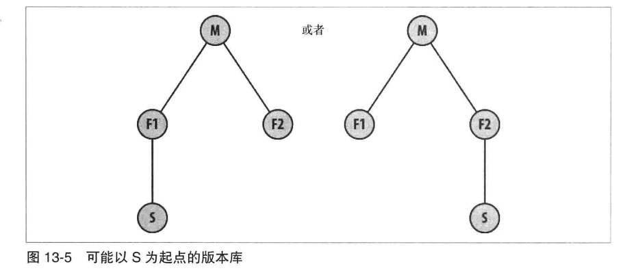
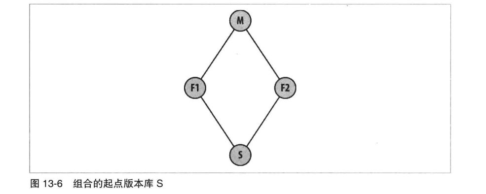
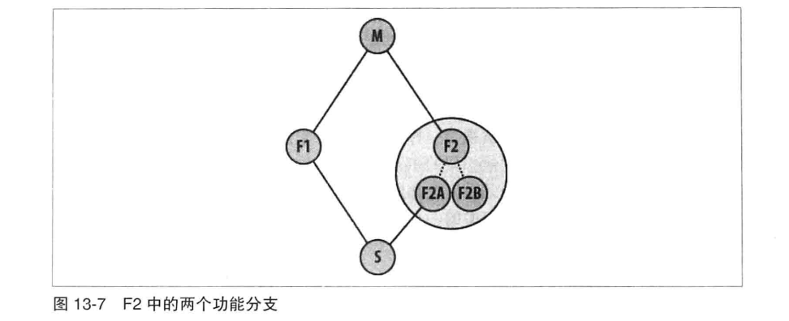

# 第十三章: 版本库管理 #

Git 有两种方法来管理和发布用于协作开发的版本库, 一种方法是集中式版本库, 一个是分布式版本库.

## 谈谈服务器 ##

在这里服务器的定义是, 一方面可能是指某个愿意与我们交互的计算机, 另一方面也可能是一些安装在机架上, 具有高可用性, 连接良好的集中式服务器.

## 发布版本库 ##

建议发布裸版本库.

### 带访问控制的版本库 ###

通过 SSH 来访问版本库, 以便实现访问控制.

### 允许匿名读取访问的版本库 ###

常见的解决方案是使用 git-daemon 或 HTTP 守护进程来将它们导出.

**使用 git-daemon 发布版本库**

建立 git-daemon 允许你使用 Git 原生协议导出版本库.

通常可以通过在裸版本库的顶级目录创建 git-daemon-export-ok 文件来把版本库标记为可导出, 也可以在运行 git-daemon 命令时加上 --export-all 选项来导出所有版本库(在目录列表中可识别的拥有 objects 或 refs 目录的版本库).

**使用 HTTP 守护进程发布版本库**

需要在 Git 裸版本库中做一个配置调整, 按照如下方式启用 hooks/post-update 选项:

```
$ cd /path/to/bare/repo.git
$ mv hooks/post-update.sample hooks/post-update
```

**使用智能 HTTP 发布版本库**

查询 git-http-backend 命令的手册页.

**通过 Git 和 HTTP 守护进程发布版本库**

可以同时提供 HTTP 和 Git 守护进程访问权限, 但可能需要在 Git 守护进程和 HTTP 守护进程间做一些调整.

### 允许匿名写入权限的版本库 ###

可以使用 Git 原生协议的 URL 形式, 为 git-daemon 服务的版本库提供匿名写入权限. 需要在发布的版本库中启用 receivepack 选项:

```
[daemon]
    receivepack = true
```

### 在 GitHub 上发布版本库 ###

可以在 GitHub 上发布版本库.

## 有关发布版本库的建议 ##

对私有代码, 甚至是你很重视其价值的共有代码, 都应该考虑使用商业 Git 托管服务.

## 版本库结构 ##

### 共享的版本库结构 ###

在 Git 中, 一个共享的, 权威的, 集中的版本库仅仅只是一个约定, 共享的集中的版本库模式在 Git 中的概念纯粹是一种社会约定和协议.

### 分布式版本库结构 ###

大型项目往往都有一个高度分布式的开发模型, 包括一个中心的, 单一的但逻辑上分离的版本库.

### 版本库结构示例 ###

Linux 内核项目是一个高度分布式的版本库和开发过程的典型范例.

## 分布式开发指南 ##

### 修改公共历史记录 ###

一旦发布一个版本库, 别人就可以进行克隆, 那你应该把它视为静态的并避免被改写.

有以下两个原因可能需要发布一个带有动态提交历史记录的分支:

1. 常见的原因是提醒其他开发人员某个分支可能的快速变化方向
2. 让其他开发人员使用已发布的变更, 虽然可能是临时的

### 分离提交和发布的步骤 ###

分布式 VCS 的一个明显优势就是提交和发布间的分离.

### 没有唯一正确的历史记录 ###

提交之间唯一真正可靠的关系, 就是提交对象中直接记录的父子关系.

## 清楚你的位置 ##

通过识别你在整体工作中的角色, 理解在变更中谁是生产者, 谁是消费者.

### 上下游工作流 ###

假如某个版本库克隆自另一个版本库, 这两个版本库间其实是没有严格的关系的. 但是我们习惯性称父版本库为新克隆的版本库的上游(upstream), 新版本库称为原始版本库的下游(downstream).

### 维护者和开发人员的角色 ###

在开发中常见的角色是维护者(maintainer)和开发人员(developer).

维护者的目标是收集, 整理, 接受或拒绝变更, 然后最终发布项目开发人员可以使用的那些分支. 维护者希望从开发人员那里接收到的变更是相关的且可以应用到已发布的分支上的.

除了改善项目之外, 开发人员的目标就是让维护者接受他的变更.

### 维护者-开发人员的交互 ###

维护者发布分支供开发人员作为其开发基础, 一经发布, 维护者就有一个无须说明的义务, 那就是不能改变已发布的分支.

### 角色的两面性 ###

在上下游版本之间的传输提交有两种基本机制:

1. 通过使用 git push 或 git pull 直接传输提交
2. 使用 git format-patch 与 git am 来发送和接收提交的描述

使用 push 和 pull 操作将该变更完全从一个版本库传送到另一个, 而补丁仅仅复制变更的文件和目录数据. push 和 pull 可以传送版本库间的合并提交, 而这些合并提交则不能通过补丁方式发送.

## 多版本库协作 ##

### 属于你自己的工作区 ###

应该创建自己私有的拷贝或者克隆的版本库来进行开发.

### 从哪里开始你的版本库 ###

Git 允许你基本上可以从项目中挑选任意的版本库作为你的起点, 即使这个版本库不是最完美的.

### 转换到不同的上游版本库 ###

假设需要开发功能 F 并且决定从主线 M 处克隆你的版本库:


假设有一个版本库 P 也克隆自 版本库 M:


使用 Git 可以非常方便的将版本库 F 切换到基于版本库 P:


### 使用多个上游版本库 ###

假设有如下的一个版本库结构, 某主线版本库 M 最终将收集版本库 F1 和版本库 F2 中有关两个不同功能的所有开发成果.


现在基于版本库 F1 或 F2 开发一些功能 S:



也可以构建一个包含 F1 和 F2 的版本库 S:



假若版本库 F2 有分支 F2A 和 F2B, 也可以选择只将其中一个分支获取到你的版本库 S:



### 复刻项目 ###

每次克隆版本库时, 这个行为就可视为复刻(fork)项目, 这个操作概念基本等同于其他 VCS 中的分支.
