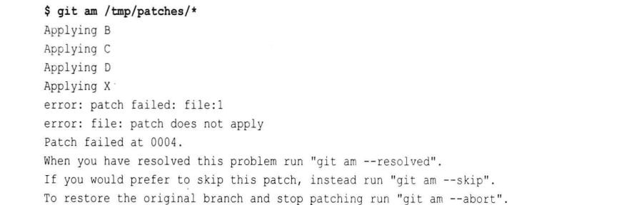
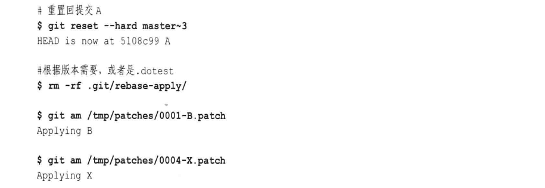

# 第十四章: 补丁 #

Git 实现了三个命令来交换补丁:

1. git format-patch 会生成 email 形式的补丁
2. git send-email 通过 SMTP 来发送一个 Git 补丁
3. git am 应用邮件消息中的补丁

## 为什么要使用补丁 ##

1. 有些情况下, Git 原生协议和 HTTP 协议都不能用来在版本库之间交换数据, 例如存在防火墙
2. 对等开发模型的一个巨大优势是合作, 而补丁是一种向同行评审(peer review) 公开分发修改建议的手段

## 生成补丁 ##

git format-patch 会使用 git diff 机制, 但是它与普通的 git diff 命令有以下两个区别:

1. git diff 会生成一个整合了所有选中提交差异的补丁, 而 git format-patch 会为每个提交生成一条邮件消息
2. git diff 不会生成邮件头, 但 git format-patch 会生成包括邮件头的完整邮件消息, 列出提交作者, 提交日期以及与该变更相关的提交日志消息

为最近 n 次提交生成补丁的最简方式是使用 -n 选项, 默认情况下 Git 为每个补丁生成单独的文件, 用一系列数字加上提交日志消息为其命名.

也可以使用一个提交范围来指定把哪些提交格式化为补丁, 例如在提交 B~D 中列出补丁:


虽然范围 B~D 包含了三个提交, 但是只会生成两个补丁, 分别是 B 和 C 之间的 diff 以及 C 和 D 之间的 diff.

下面添加一个基于提交 B 的 alt 分支, 并进行一次合并:


下面格式化 D..F 范围的提交补丁:

```
$ git format-patch master~2..master
0001-X.patch
0002-Y.patch
0003-Z.patch
0004-F.patch
```

合并提交本身并不会生成补丁.

当为 git format-patch 指定单个提交时, 默认会解释为指定范围 commit..HEAD, 而且根提交默认不生成补丁. 如果确实需要为每个提交(包括根提交)生成补丁, 可以指定 --root 选项:

```
git format-patch --root end -commit
```

如果需要生成在某个分支中的提交补丁, 可以使用如下方式:

```
$ git checkout master
$ git format-patch alt
0001-C.patch
0002-D.patch
0003-F.patch
```

**补丁和拓扑排序**

补丁是通过 git format-patch 命令按照拓扑排序顺序创建的, 对于一个给定的提交, 所有父提交的补丁会先于该提交的补丁生成和发出.

## 邮递补丁 ##

可以使用 git send-email 命令来邮寄补丁:

```
$ git send-email -to xxx@example.org 0001-A.patch
```

## 应用补丁 ##

Git 的高层命令 git am 的一部分是使用底层命令 git apply 实现的. git apply 命令是补丁应用过程中的主力, 它接受 git diff 或者 diff 风格的输出, 并且将其应用到当前工作目录中.

现在假设有一些补丁 B~F, 并且创建一个和最开始的原始版本库相同的版本库, 然后使用 git am 应用补丁:



在这次应用中出现了失败, 但是通过 git show-branch 可以看到, Git 成功的应用了 D 及 D之前的补丁.

查看补丁以及受补丁影响的文件能够帮助你解决问题, 当执行 git am 命令时, 会出现 .git/rebase-apply 目录, 其中包含关于整个补丁系列和每个补丁的单独部分的不同上下文信息.

可以使用 **git am --skip** 命令跳过该补丁, 但是这种方法是不能干净的应用补丁序列的. 而且因为提交 X 是基于提交 B 的, 虽然可以恢复到只有提交 A 的状态, 然后依次应用 B 以及 X, 但是这也不能从根本上解决问题, 因为这需要你重建原始分支结构.
 


Git 为此提供了一个简单的技术解决方案, Git 为补丁文件提供了额外的信息:


Git 添加了 index 行, 用来表示这个补丁要应用到什么初始状态, index 行的第一个数是指 Git 对象库中该补丁应用到的 blob 的 SHA1 散列值.

有一种叫做三路合并的机制: 有一个文件的当前版本, 再有一个替代版本, 然后定位补丁应用到的文件的原始基础版本. 把 -3 或者 -3way 选项添加到 git am 命令中, Git 就能实现对该场景的重建.


这次出现了冲突, Git 将 git am -3 临时挂起, 并等待用户解决冲突. 当冲突解决之后(需要 git add 文件), 使用 --resolved 选项继续执行 git am -3 命令, 就可以将所有补丁以线性序列应用, 并且在主分支的提交历史中反映出来.

## 坏补丁 ##

补丁格式具有内部一致性检查, 能够防止错误的补丁对版本库造成破坏.

## 补丁与合并 ##

Git 能够处理同一版本库混合应用补丁和拉取相同变更的情况.

直接抓取合并拥有复杂历史记录的分支将会在接收版本库中产生与应用补丁序列不同的历史记录, 因为在复杂分支上创建补丁序列会将提交图拓扑排序成一个线性的历史.
