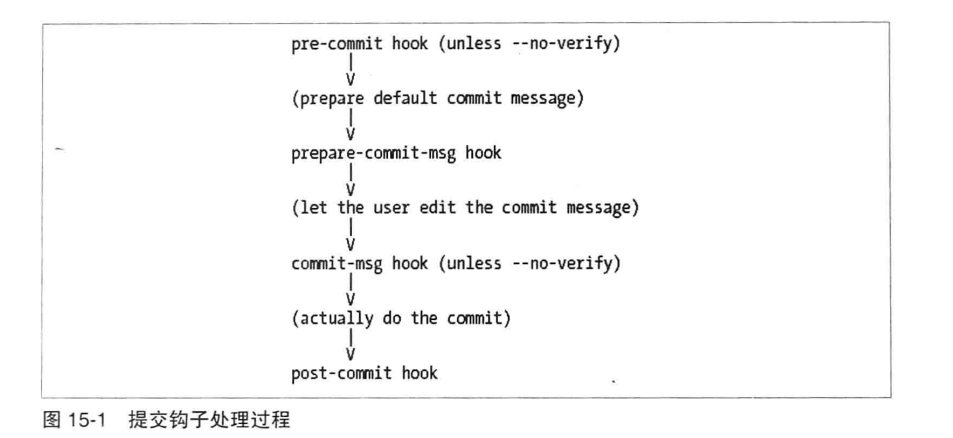
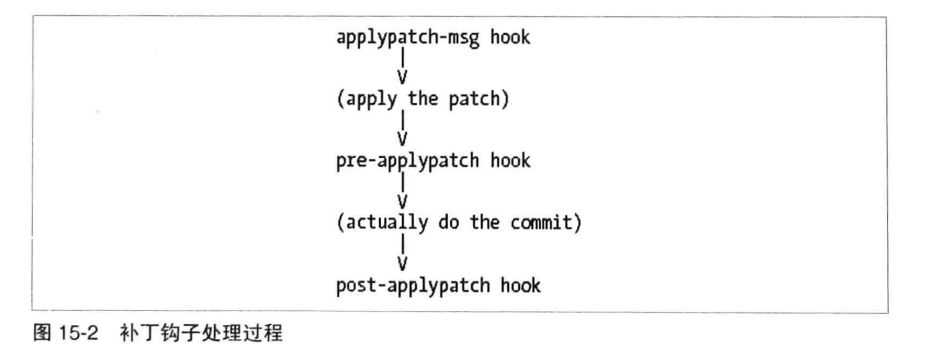
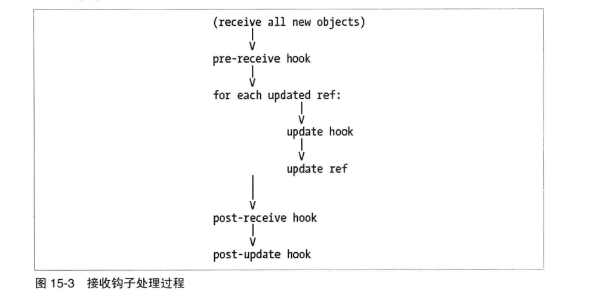

# 第十五章: 钩子 #

可以使用钩子(hook), 这样当版本库中出现某些特殊事件时就会触发执行一个或多个任意的脚本. 钩子只属于并作用于一个特定的版本库, 如果需要在每个人的开发版本库中都设置钩子, 那么需要通过其他方法来复制 .git/hooks 目录.

大多数钩子属于以下两类:

- 前置(pre)钩子会在动作完成前调用. 假如需要在变更前进行批准, 拒绝或调整操作, 可以使用这种钩子
- 后置(post)钩子会在动作完成后调用. 常用来触发通知或者进行额外处理, 例如执行构建或关闭BUG

一般而言, 钩子应当作为最后的手段, 只有当你通过其他方式不能达到相同效果的时候才使用钩子. 而且钩子的使用会牵连很多东西:

- 钩子会改变 Git 的行为
- 钩子可以使原来很快的操作变得很慢
- 一个出问题的钩子脚本会影响你的工作和效率
- 版本库中的钩子不会自动复制

有 5 个合法的理由去为 Git 命令或操作添加钩子:

1. 为了撤销底层命令的决定. update 和 per-commit 钩子的目的既是为此
2. 为了在命令执行后对生成的数据进行操作. 例如 commit-msg 修改提交日志消息
3. 在仅能使用 Git 协议访问时对链接的远程端进行操作. 执行 git update-sever-info 的 post-update 钩子既是为此
4. 为了获得互斥锁
5. 为了根据命令的输出执行几种可能的操作之一. 例如 post-checkout 钩子.

## 安装钩子 ##

每个钩子都是一个脚本, 作用于一个特定的版本库的钩子集合都在 .git/hooks 目录下. 例如, 在 git commit 之前执行的钩子称为 .git/hooks/pre-commit.

每个钩子脚本都需要遵循 UNIX 脚本的基本规范.

### 钩子示例 ###

在创建新的版本库时, 有些钩子会自动复制自你的 Git 模板目录. 例如在 Ubuntu 中该目录是 /usr/share/git-core/templates/hooks .

1. 模板钩子可能不是你想要的. 你可以阅读, 修改, 学习它们.
2. 默认时它们都是禁用的. 根据 Git 版本的不同, 可以通过移除可执行位或者在文件名添加 .sample 后缀来禁用.
3. 如果要启用示例钩子, 需要移除文件名中的 .sample 后缀并添加可执行权限.

### 创建第一个钩子 ###

创建一个新版本库, 然后创建一个 pre-commit 钩子, 来阻止包含 broken 这个词的变更被检入:

```
$ vim .git/hooks/pre-commit

#!/bin/bash
echo "Hello, I'm a pre-commit script" >&2
if git diff --cached | grep '^\+' | grep -q 'broken'; then
    echo "ERROR: Can't commit the world 'broken'" >&2
    exit 1    # reject
fi
exit 0

```

## 可用的钩子 ##

可以使用 git help hooks 命令来查看当前版本的 Git 中可用的钩子.

### 与提交相关的钩子 ###

当执行 git commit 时, Git 会执行如下图的过程:



- pre-commit 钩子会在用户能够编辑提交信息前执行, 可以借助这个钩子来放弃提交或者修改提交内容
- pre-commit-msg 钩子会在 Git 的默认消息展示给用户前执行, 可以用它来修改默认的提交消息模板
- commit-msg 钩子在用户编辑提交消息后执行, 可以用它来验证或修改提交消息
- post-commit 钩子来提交完成后执行, 可以用它来更新日志, 或者自动标记 Bug 修复

### 与补丁相关的钩子 ###

当执行 git am 时, Git 会执行如下图的过程:



- applypatch-msg 钩子可以检查补丁中的提交消息来决定是否接受
- pre-applypatch 钩子在应用补丁之后, 提交结果之前执行
- post-applypatch 钩子和 post-commit 钩子类似

### 与推送相关的钩子 ###

当执行 git push 时, Git 接收端会执行如下图的过程:



- pre-receive 接收所有需要更新的引用列表, 包括新旧对象指针. 可以用来接受或拒绝所有变更, 保证事务完整性.
- update 钩子只在每个引用更新的时候调用一次. 可以选择接受或拒绝单个分支的更新, 并触发一个动作: 例如关闭一个 BUG.
- post-receive 钩子和 pre-receive 钩子输入相同. 例如可以发送一个更新提醒邮件消息.
- post-update 钩子, 不应该使用. 已被 post-receive 钩子替代.

### 其他本地版本库的钩子 ###

还有一些其他的钩子:

- pre-rebase 钩子在需要变基一个分支时调用, 可以用来避免在不应该变基的分支上执行 rebase 操作
- post-checkout 在切换分支或者检出文件后调用.
- post-merge 在执行合并操作后调用. 如果你的 pre-commit 钩子对版本库做了一些变更, 那么可能也需要使用 post-merge 脚本做一些类似的事.
- pre-auto-gc 可以帮助 git gc --auto 决定是否需要清理.
