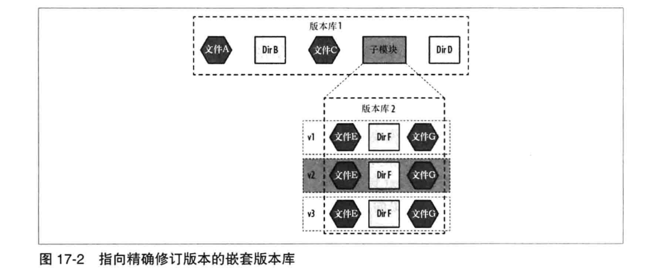

# 第十七章: 子模块最佳实践 #

子模块提供比较高的精确度, 它不仅指向嵌套的版本库的网络地址, 还指向嵌套版本库的提交散列值.



## 子模块命令 ##

子模块有以下常用的命令:

- git submodule add address localdirname: 注册一个新的子模块, 并可选地指定文件夹名称
- git submodule status: 查看所有子模块的提交引用和脏状态
- git submodule init: 使用 .gitmodules 来更新开发人员版本库的 .git/config 文件
- git submodule update: 使用 .git/config 中的地址抓取子模块内容, 并在分离的 HEAD 指针状态下检出上层项目的子模块记录引用
- git submodule summary: 展示每个子模块当前状态相对于提交状态间的变化的补丁
- git submodule foreach command: 对每个子模块执行一条 shell 命令并提供 $path 和 $sha1 等其他有用的标识符

## 为什么要使用子模块 ##

常见的动机是模块化, 有利于保存子组件的现有目录结构的完整性.

## 子模块准备 ##

1. 将子目录从上层目录中提取出来, 并使其与上层项目的目录处于同一层
2. 将子目录重命名, 以便更准确的表达出这个子模块的性质
3. 为子模块创建一个新的上流托管
4. 将子模块项目作为一个独立的 Git 版本库进行初始化, 并提交到上流托管
5. 在上层项目中添加一个 Git 子模块, 指向新的子模块的 URL
6. 提交并推送到上层目录, 其中包括新建的 .gitmodules 文件

## 为什么是只读的 ##

建议通过只读地址来克隆, 这降低了使用子模块的复杂性.

## 为什么不用只读的 ##

可以直接在上层项目的子目录中修改子模块代码, 并提交, 推送与检出, 但风险更大.

## 检查子模块提交的散列 ##

子模块提交的引用存储在树对象中, 只是它的条目类型是提交而不是树或者 blob, 可以使用以下命令查看:

```
$ git ls-tree HEAD
```

## 凭据重用 ##

Git 子模块命令可以从上层项目克隆的操作过程中得到凭据, 并将其向下传递给任何被 --recurse-submodules 调用的行为.

## 用例 ##

- 开源书中的示例代码, 例如 <Building and Testing Gradle>
- 插件
- 大版本库: 子模块可以缩小版本库大小
- 可见约束: 使复合程序的可见性分离, 例如对子模块使用不同的权限

## 版本库的多级嵌套 ##

子模块可以成为上层项目从而包含其他子模块.

## 子模块的未来 ##

支持子模块的工具增加了.
