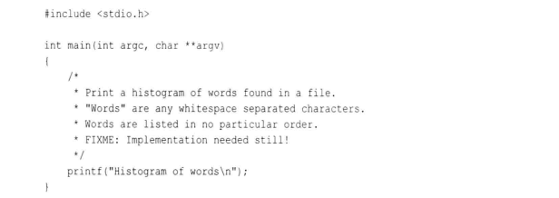
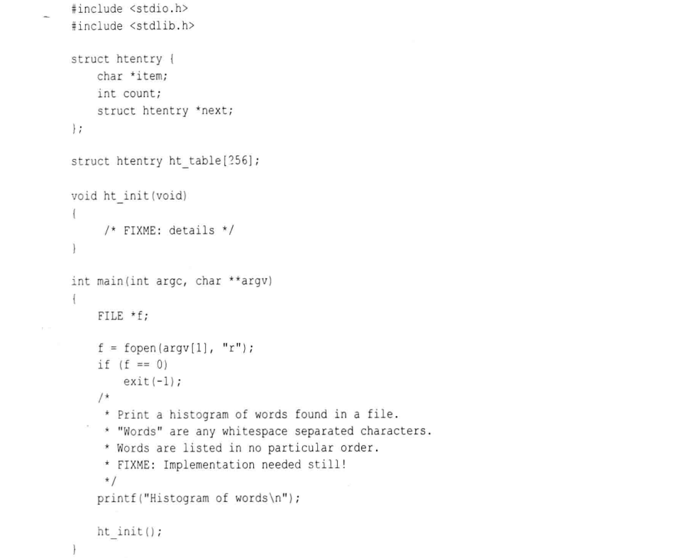
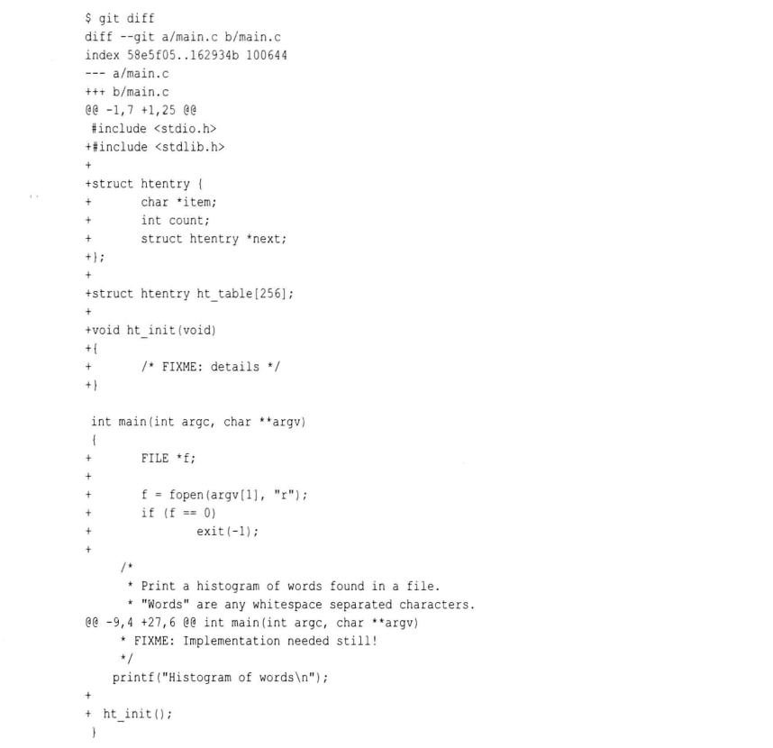

# 第十九章: 高级操作 #

## 使用 git filter-branch ##

git filter-branch 是一个通用的分支操作命令, 可以通过自定义命令来利用它操作不同的 git 对象, 从而重写分支上的提交. 一些过滤器可以对提交起作用, 一些对树对象和目录结构起作用, 还有一些则可以操作 git 环境.

filter-branch 命令会在版本库中的一个或多个分支上运行一系列过滤器, 每个过滤器可以搭配一条自定义的过滤器命令, 这些过滤器按照顺序执行(可以不必全部执行), 于是前面的过滤器可以影响后面的过滤器的行为.

在 git 1.7.9 版本中, git filter-branch 是一个 shell 脚本, 除了 commit-filter 之外的每个 command 都利用 eval 在 shell 上下文中执行. 每个过滤器的说明如下:

- env-filter command: 用来创建或改变 shell 环境变量
- tree-filter command: 允许修改一个目录中将要被树对象所记录的内容, .gitignore 文件对该指令不起作用
- index-filter command: 在提交之前变更索引的内容
- parent-filter command: 允许重建每个提交的父子关系
- msg-filter command: 在真正创建一个提交之前执行, 允许编辑提交信息
- commit-filter command: 执行提交操作步骤的控制权, 接受一个新的 tree object 和一系列 -p parent-obj 参数, 提交消息通过 stdin 传入
- tag-name-filter command: 重写已经存在的标签
- subdirectory-filter command: 将历史记录改写行为限制在影响特定目录的几个提交中

git filter-branch 完成后, 原先包含整个旧的提交历史记录的引用将会以 refs/original 新引用存在, 在执行该操作前需要保证该目录为空, 执行之后可以将该目录删除.

### 使用 git filter-branch 的例子 ###

一个比较常见的使用场景是: 你创建了一个充满了提交历史记录的版本库, 想清理它或做大规模的修改, 从而使得别人能够克隆和使用它.

**使用 git filter-branch 删除文件**

Git 维护版本库中每个文件的完整历史记录, 因此简单的使用 git rm 删除文件是达不到彻底删除文件的效果的. 使用 git filter-branch 就可以从版本库的任何或者每个提交中删除文件, 使得这个文件看起来就是从来没有在版本库中出现过一样.

首先创建一个版本库, 其中包含一些读书笔记, 这时我们要删除 1984 文件的一切记录. 我们可以使用 tree-filter 和 index-filter 来达到效果, 使用 tree-filter 的命令如下:

```
$ git filter-branch --tree-filter 'rm 1984' master
```

使用上述命令之后, 我们发现命令执行的过程失败了. 这是因为 Git 会对 master 分支的每个提交建立该提交的上下文, 并且执行 rm 命令, 但是文件 1984 是在第三个提交引入的, 所以对第一个提交执行 rm 命令会失败. 修改之后的命令如下:

```
# 使用 -f 选项来强制删除并且忽略不存在的文件
$ git filter-branch --tree-filter 'rm -f 1984' master
```

Git 会输出当前重写的所有提交, 但是只有最后一个显示在屏幕上. 可以通过管道命令将 Git 的输出重定向到 less, 即可以看到所有重写的提交.

使用 index-filter 的命令如下:

```
$ git filter-branch --index-filter 'git rm --cached --ignore-unmatch 1984' master
```

因为 1984 这个文件是从第三个提交引入的, 所有 Git 会给从第三个提交开始的所有提交生成新的 SHA1 值, 在重写和过滤的过程中, Git 创建并维护新老提交的对应关系表, 并提供 map 函数来获取它.

**使用 git filter-branch 编辑提交信息**

在之前的示例中, 我们删除了 1984 文件, 但是一些提交信息中仍然提到了 1984. 例如:


我们可以使用 --msg-filter 过滤器来重写提交信息, 该过滤器命令从 stdin 接受老的提交信息并将修改后的文本你写入 stdout. 使用的命令如下:

```
$ git filter-branch --msg-filter '
sed -e "/1984/d" -e "s/few classics/classic/"' master
```

### filter-branch 的诱惑 ###

git filter-branch 也可以作用于多个分支和引用, 假设需要将操作作用于所有分支:

```
# 使用 --all 作用于所有分支
$ git filter-branch --index-filter \
"git rm --cached -f --ignore-unmatch '*.jpeg'" \
-- --all
```

如果你需要同时将所有标签从过滤前的旧提交指向新提交:

```
$ git filter-branch --index-filter \
"git rm --cached -f --ignore-unmatch '*.jpeg'" \
--tag-name-filter cat \
-- --all
```

可以使用如下的命令找到修改过名字的文件:

```
$ git log --name-only --follow --all - file
```

## 我如何学会喜欢上 git rev-list ##

### 基于日期的检出 ###

可以利用类似 git checkout master@{Jan 1, 2011} 的命令可以实现基于日期的检出, 该命令使用 reflog 来找到 master 分支上基于日期的引用. 但是这种方式有几个问题可能导致这种方式失效:

1. 版本库没有启用 reflog, 或者 reflog 过期
2. 它要求依据 reflog 依据你对 master 分支的操作记录来查找在给定时刻分支指向哪个提交, 而不是根据该分支上的提交时间线来查找. 这两者可能是没有关系的.
3. 可能造成死锁

所以应该使用 git rev-list 命令, 它提供了丰富的选项组合, 帮助用户对有很多分支的复杂历史记录排序, 挖掘潜在模糊的用户特征, 限制搜索空间, 最后在提交历史记录中定位特定的提交.

例如找出 master 分支上 2011 年的最后一个提交:

```
$ git clone git://github.com/gitster/git.git
$ cd git
$ git rev-list -n 1 --before="Jan 1, 2012 00:00:00" master
```

git rev-list 命令参考的是 CommitDate(提交日期) 字段, 而不是 AuthorDate(创作日期) 字段.

**基于日期的检出的注意事项**

Git 处理日期的部分是通过一个叫 approxidate() 函数实现的, Git 在解析你作为参数传入的日期时是近似的.

```
# 精确的时间
$ git rev-list -n 1 --before="Jan 1, 2012 00:00:00" master

# 假定为当前时间
$ git rev-list -n 1 --before="Jan 1, 2012" master
```

尽管你在按特定时间查询提交时, 可以得到一个有效的结果, 但是可能过几天再以同样的查询条件查询时会得到不同的结果(可能从其他分支合并了更符合条件的提交).

### 获取文件的旧版本 ###

可以保持当前工作目录的状态, 而只是将其中某个文件恢复到某个历史版本. 可以借助 rev-list 技术来找出包含所要文件的提交, 在查找时 Git 允许将搜索限定到特定的文件或一系列文件(称为路径限制 path limiting). 

```
$ git rev-list master --date.c
```

在找到提交之后有三种方法可以用来得到文件的那个版本:

1. 直接检出那个提交的文件并覆盖工作目录中的当前文件

```
$ git checkout ecee9d9 date.c
# 如果不知道提交ID但是知道提交日志包含的一些内容
$ git checkout :/"FIx PR-1705" main.c
```

2. 通过 show 命令写入文件

```
$ git show ecee9d9:date.c > date.c-oldest
```

3. 通过 cat-file 命令写入文件

```
$ git cat-file -p 89967:date.c > date.c-first-change
```

第二种和第三种方式有细微的差别, 第二种方式会利用任何可用的文本转换方法对输出内容进行过滤, 第三种不会进行过滤.

## 数据块的交互式暂存 ##

数据块的交互式暂存(Interactive Hunk Staging) 可以用来组织和简化开发过程中的提交, 使其简单易懂. 例如将需要提交的内容拆分成多个补丁, 一个主题特性一个补丁.

要交互式的暂存数据块, 只需要在 git add 命令后加上 -p 选项即可. 通过这种方式可以不一次性的暂存整个文件的所有改动, 只选择其中特定的部分来暂存到索引中, 用于下一次提交.

假设需要开发一个程序来统计一个文件里所有的单词并输出直方图, main.c 文件最开始的内容如下:



然后添加 Makefile 和 .gitignore 文件并提交:

```
$ mkdir /tmp/histogram && cd /tmp/histogram
$ git init
$ git add main.c Makefile .gitignore
$ git commit -m "Initial histogram program."
```

接下来在 main.c 文件中新增一些代码:



在这次的开发中引入了两个不同概念的改动: 散列表的结构和存储, 以及读文件的操作. 在理想的情况下这两个概念应该分两次提交到程序中, Git 有助于方便的进行拆分. Git 所谓的数据块就是通过 diff 命令得到的一组文本行, 由类似下面的标识标记:

```
@@ -1,7 +1,27 @@
@@ -9,4 +29,6 @@ int main(int argc, char **argv)
```

在本例中, git diff 标记了两个数据块:



当使用 git add -p 进行交互式的暂存时, Git 会对每一个数据块征询你的意见. 当我们仔细查看这两个数据块并考虑我们的需求: 我们需要分割改动的部分, 使得与一个概念相关的改动能够作为一次提交. 但是第一个数据块即包含了散列表, 又包含了文件操作部分, 所以我们需要在数据块暂存时分割数据块, 只要是行首带有 "+" 或 "-" 标记且与增删相关的行都可以作为切分数据块的地方. 具体操作如下:

```
$ git add -p
diff **

Stage this hunk [y,n,q,a,d,/,j,J,g,s,e,?]?
```

这时可以选择 s, 意味着切分(split), 然后选择 y 进行暂存或者 n 不进行暂存. 在决定好需要暂存的内容之后, 可以使用 git commit 进行提交, 但是这时不能在加文件, 或者会提交整个文件的内容.

在上面的例子中, 我们将 **#include <stdlib.h>** 这一行内容暂存到了散列表的补丁中, 接下来尝试解决该问题. 首先将版本库回退到第一次提交, 然后使用如下命令:

```
git add -p
```

输入 s, 然后不再选择 y 而是选择 e(编辑), 这将进入一个编辑器并可以手动编辑当前补丁, 删除 stdlib.h 那一行并退出编辑器, Git 默认你退出编辑器时其中存留的内容既是需要暂存的内容. 然后继续操作其他数据块. 然后同样的提交即可.

也可以使用 git add -i 命令来实现交互式暂存, 它允许你选择将哪些路径暂存到索引中, 而且对你选择的路径可以使用子选项 patch 进入之前描述的单个文件数据块暂存的机制中.

## 恢复遗失的提交 ##

### git fsck 命令 ###

Git 提供了 git fsck 命令来帮助找回丢失的数据. Git 版本库中的每个对象都会和另一个对象连接起来, 并和分支名, 标签名或其他符号引用挂上勾. 一些命令或操作会使一些对象失去和其他对象的连接, 从而脱离版本库完整的数据结构, 这些对象叫做不可及的或者悬挂的, 即从任何命名的引用开始, 沿着每个标签, 提交, 父提交和数对象引用, 遍历整个版本库的数据结构, 都无法达到这些丢失的对象. 可以使用以下命令列出版本库中的所有对象:

```
$ cd path/to/some/repo
$ ls -R .git/objects/
```

可以使用以下命令列出未引用对象:

```
$ git fsck
```

首先产生一个遗失的提交:

```
# 创建版本库
$ mkdir /tmp/lost
$ cd /tmp/lost
$ git init

# 产生第一个提交
$ echo "foo" >> file
$ git add file
$ git commit -m "Add some foo"

# 产生第二个提交
$ echo bar >> file
$ git commit -m "Add some bar" file

# 强制重置到第一个提交, 这会导致丢失一个提交
$ git reset --hard HEAD^

# 暴力的去除 reflog, 否则第二个提交会被 reflog 引用, git fsck 不能列出它
# 也可以不删除 reflog, 使用 git fsck --no-reflog 找到在没有 reflog 时悬挂的对象
$ rm -rf .git/logs

# 列出不可达的对象
$ git fsck

# 查看提交内容
$ git show 11e0dc9c
# 查看文件内容
$ git show 3bd1f0e
```

每次使用 git add 向索引中添加文件时都会向版本库添加一个 blob, 如果随后修改了该文件并重新添加到索引, 那么之前生成的 blob 对象就会变成悬挂的.

### 重新连接遗失的提交 ###

对于丢失的 blob 对象, 可以通过 git show 命令来获取它的完整内容并重新添加到版本库即可. 对于提交对象, 通常做法是引入一个新分支来找回提交, 因为它很可能是丢失的一系列提交的一部分或是整个分支都丢失了.

```
$ git branch recovered 11e0dc9c
$ git show-branch
```
