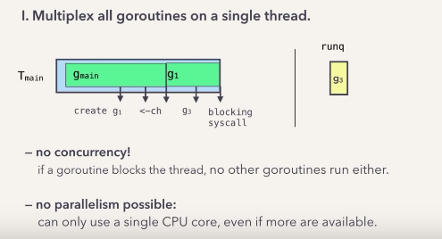

# Golang 调度器的演化史 #

## 什么是调度器 ##

调度器是Golang程序的幕后的协调者(the behind-the-scenes orchestrator)，假设我们有如下的一段代码:

```
func main() {
    // Create goroutines.
    for _, i := range images {
        go process(i)
    }
    // Wait
    <-ch
}

func process(image) {
    // Create goroutines.
    go reportMetrics()

    complicatedAlgorithm(image)

    // Write to file.
    f, err := os.OpenFile()
}
```

Go调度器确保你创建的goroutine能够正确且并行的运行起来，并且在适当的时候暂停或者唤醒它们。

## 为什么要了解调度器 ##

因为调度器的调度觉得可能会影响程序的性能。

## 为什么需要调度器 ##

goroutines 可以视为用户态线程:

- 类似内核线程，但是由go runtime管理
- 比内核线程更轻量级；更少的内存占用(stack=2KB)；创建/销毁/上下文切换更快(switch=~tens of ns)
- OS只知道内核线程，由Go调度器将goroutine放到内核线程中执行

## 什么时候进行调度 ##

当有操作会影响goroutine的执行的时候, 例如:

- 创建 goroutine
- 阻塞在channel的读写
- 系统调用等等(此时线程也会阻塞)

## 目标 ##

- 使用少量的线程
- 高并发: 能运行大量的goroutine
- 扩展性: 可以轻松扩展的多个CPU

## 两个问题 ##

- 什么时候创建线程
- 怎样分配goroutine到线程上

## 1. 只使用一个线程 ##



- 没有并发
- 不能扩展到多个CPU

## 2. 一个goroutine一个线程 ##

- 违反了使用少量线程的目标

## 3. 线程重用 ##

- runqueue需要一个lock, 在goroutine很多时争用
- 不能限制线程数量

## 4. 限制线程数量 ##

- 线程数量应该多少: CPU数量
- 当CPU数量增加时runqueue争用出现, 不能扩展到多个CPU

测试数据:

- 4core: 4x
- 16core: 31x, worth

解决方式:

- one runqueue per thread
- steal from other runqueue, balance work

仍然存在的问题:

- g block 时会 block thread
- monitor 线程可以把block thread runqueue 给其他thread
- 为什么不是自己线程? 不知道 block 时间长度
- 需不需要重新启动线程？现在是限制了线程数量, 但是有一个block了，相当于可用数量变少
- monitor 启动新线程，这时持有 runqueue 的就是 P，限制的是P的数量

## 最终 ##

- limit #(goroutine-running) thread to CPU cores (GOMAXPROCS)
- reuse threads

## 其他问题 ##

- 非抢占: cpu bound 型的; sysmon 检测运行了(> 10ms)的并停下它, 放到 global runqueue(lower priority)
- no goroutine priorities
- no strong preemption: no strong fairness or latency guarantees: Non-cooperative goroutine preemption
- is not aware of the system topology: NUMA-aware scheduler

# 参考资料 #

- [The Scheduler](https://www.youtube.com/watch?v=YHRO5WQGh0k)