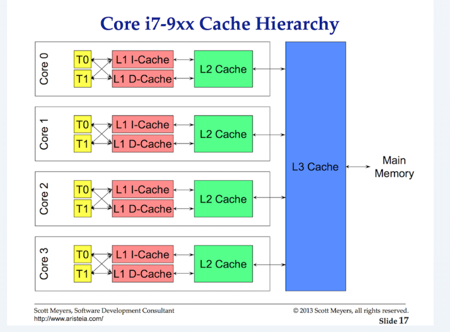
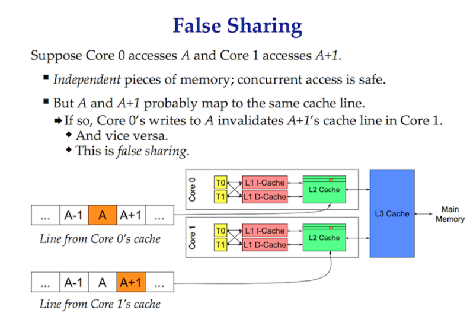

# Golang调度器 #

## 简介 ##

Golang允许你并发的运行你的程序, 这是由Golang调度器和操作系统调度器协力完成的。

## OS调度器 ##

操作系统是一个非常复杂的软件，可以在多个CPU上正确的运行，正确处理包括[CPU caches和NUMA](http://frankdenneman.nl/2016/07/06/introduction-2016-numa-deep-dive-series/) 等各种情况。

操作系统把一个执行单元称为线程，这也是操作系统调度的基本单位。每一个程序运行起来之后都称为一个进程，每个进程都有一个初始线程，并且可以创建更多的线程。线程可以同时运行在不同的CPU核心上。

### 指令执行 ###

CPU通过 PC 的值来跟踪下一条需要执行的指令的地址。

### 线程状态 ###

一个线程可能有如下的几种状态:

- Waiting: 等待，比如等待网络，在执行系统调用
- Runnable: 可运行，表示线程可以被调度到CPU上执行
- Executing: 运行中

### 负载类型 ###

- CPU消耗型: 线程主要使用CPU
- IO消耗型: 线程主要在等待IO

### 上下文切换 ###

OS的调度器是主动抢占式的，可能在任意时间将任意线程调度到任意CPU上运行，这时就会发生上下文切换。一次上下文切换需要上千条指令，这对CPU类型的线程是不利的。

### Less Is More ###

OS调度器一般在一个固定的[调度时间片](https://lwn.net/Articles/404993/)中进行调度，并且有复杂的[调度决策](https://blog.acolyer.org/2016/04/26/the-linux-scheduler-a-decade-of-wasted-cores/)。当有很多线程等待调度时会增加调度耗时。

### 平衡 ###

需要在系统的CPU核心数和线程数之间取得一个平衡。

### Cache Lines ###

在多核系统中，每个核心都可能有自己的来避免访问主存(内存)时的消耗(一般100-300个时钟周期)。Cache和主存的内存交换以一个[Cache Line(64字节)](https://www.youtube.com/watch?v=WDIkqP4JbkE)为单位，这表示这些数据使用的是[值语义](https://www.ardanlabs.com/blog/2017/06/design-philosophy-on-data-and-semantics.html)。

当有多个CPU访问到相同的Cache Lines，可能造成问题。这时会导致CPU去主存从新同步数据，这称为[缓存一致性问题](https://youtu.be/WDIkqP4JbkE)。

## Go 调度器 ##

- P: 一个可以被执行的上下文
- M: 一个线程，仍然被OS调度
- G: 一个 goroutine

P的数量可能等于CPU的核心数，一个P必须被交给一个M才能执行；一个G既是一个用户态线程，必须被一个P拥有才能被执行。

### 协作式调度 ###

Go调度器和OS调度器不同，它不是抢占式的。但是Golang设计了一些机制来抢占Goroutine的运行，使它表现得和抢占式调度相似。

### 上下文切换 ###

在以下4种情况下可能发生调度:

- 使用 go 启动协程
- 垃圾收集
- 系统调用
- 同步和编排: 包括 atomic, mutex 或者 channel 操作

# 参考资料 #

- [Scheduling In Go](https://www.ardanlabs.com/blog/2018/08/scheduling-in-go-part1.html)