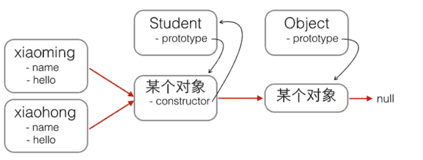
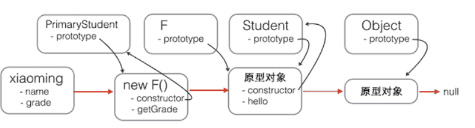

# JavaScript 笔记 #

## 1 简介 ##

### 1.1 历史 ###

在上个世纪的 1995 年, Brendan Eich 在两周之内设计出了 JavaScript 语言，

### 1.2 ECMAScript ###

为了让 JavaScript 成为全球标准, 几个公司联合 ECMA 组织定制了 JavaScript 语言的标准, 被称为 ECMAScript 标准.

### 1.3 JavaScript 版本 ###

最新的 ES6 已经在 2015年6月正式发布.

## 2 快速入门 ##

JavaScript 代码可以直接嵌入网页的任何地方, 例如常见的放到 head 中:

```
<html>
    <head>
        <script>
            alert("Hello, world");
        </script>
    </head>
    <body>
        
    </body>
</html>
```

还可以将 JavaScript 代码保存到单独的 .js 文件, 然后再引入:

```
<html>
    <head>
        <script src="/static/js/abc.js" type="text/javascript">
        </script>
    </head>
    <body>

    </body>
</html>
```

其中的 type 字段可以省略.

### 如何编写 JavaScript ###

可以使用任何文本编辑器来编写 JavaScript 代码, 例如:

- Visual Studio Code
- Sublime Text
- Notepad++

### 如何运行 JavaScript ###

要让浏览器运行 JavaScript 必须先有一个 HTML 页面, 然后在页面中引入 JavaScript 即可.

### 调试 ###

可以使用 Chrome 来调试 JavaScript 代码:

1. 安装 Chrome
2. 在页面点击 F12 打开开发者工具

### 2.1 基本语法 ###

#### 2.1.1 语法 ####

JavaScript 语法类似 Java 语言的语法, 每个语句以 ; 结束, 语句块使用大括号包围.

```
if (2 > 1) {
    x = 1;
    y = 2;
    z = 3;
    if (x < y) {
        z = 4;
    }
    if (x > y) {
        z = 5;
    }
}
```

#### 2.1.2 注释 ####

以 // 开头直到行尾的字符被视为行注释, 也可以用 /* .. */ 把多行字符包裹起来作为块注释.

#### 2.1.3 大小写 ####

JavaScript 严格区分大小写.

### 2.2 数据类型和变量 ###

#### 2.2.1 Number ####

JavaScript 不区分整数和浮点数, 统一用 Number 表示:

```
123; // 整数123
0.456; // 浮点数0.456
1.2345e3; // 科学计数法表示1.2345x1000，等同于1234.5
-99; // 负数
NaN; // NaN表示Not a Number，当无法计算结果时用NaN表示
Infinity; // Infinity表示无限大，当数值超过了JavaScript的Number所能表示的最大值时，就表示为Infinity
```

#### 2.2.2 字符串 ####

字符串是以单引号或双引号括起来的任意文本.

#### 2.2.3 布尔值 ####

包括 true 和 false 两种.

#### 2.2.4 比较运算符 ####

在 JavaScript 中有两种相等运算符:

1. ==: 自动转换数据类型再比较, 一般不应该使用
2. ===: 不自动转换类型

NaN 这个特殊的 Number 和任意其他值都不等, 包括它自己, 需要通过 isNan 函数来判断.

#### 2.2.5 null 和 undefined ####

1. null 表示一个空值
2. undefined 表示未定义

大多数情况下都应该用 null, undefined 仅仅在判断函数参数是否传递的情况下使用.

#### 2.2.6 数组 ####

数组用 [] 表示, 元素之间用逗号分隔, 也可以使用 Array() 函数实现. 数组的元素可以通过索引来访问, 默认的索引起始值为0.

#### 2.2.7 对象 ####

JavaScript 的对象是由一组键-值组成的无序集合, 所有的键都是字符串类型, 值可以是任意的数据类型.

#### 2.2.8 变量 ####

变量在 JavaScript 中使用一个变量名表示, 变量名是大小写英文, 数字, $ 和 _ 的组合, 而且不能是数字开头, 也不能是 JavaScript 的关键字. 可以使用如下方式申明一个变量:

```
var a;
```

变量只能使用 var 申明一次.

#### 2.2.9 strict模式 ####

在 JavaScript 中不强制要求用 var 申明变量, 如果一个变量没有通过 var 申明就被使用, 那么该变量自动被申明为全局变量.

为了修复这一设计缺陷, ECMA在后续规范中推出了 strict 模式, 在该模式下的代码强制通过 var 申明变量, 未申明即使用的将导致运行错误. 可以在 JavaScript 代码的第一行加上如下代码启用 strict 模式:

```
'use strict';
```

### 2.3 字符串 ###

JavaScript 的字符串就是用单引号或双引号括起来的字符.

#### 2.3.1 多行字符串 ####

可以使用反引号来表示多行字符串:

```
`这是一个
多行
字符串`;
```

#### 2.3.2 模板字符串 ####

可以使用加号连接多个字符串, 或使用 ES6 新增的模板字符串:

```
var name = '小明';
var age = 20;
var message = `你好, ${name}, 你今年${age}岁了!`;
alert(message);
```

#### 2.3.3 操作字符串 ####

- length: 获取长度
- [index]: 获取指定位置的字符
- toUpperCase(): 转换为大写
- toLowerCase(): 转换为小写
- indexOf(): 搜索指定字符串出现的位置
- substring(): 返回指定索引区间的子串

字符串是不可变的, 如果对字符串的某个索引赋值, 不会有任何错误也不会有任何效果.

### 2.4 数组 ###

JavaScript 的 Array 可以包含任意数据类型, 并通过索引来访问每个元素. 可以通过 length 属性来访问 Array 的长度:

```
var arr = [1, 2, 3.14, "Hello", null, true];
arr.length; // 6

var arr = [1, 2, 3];
arr.length; // 3
arr.length = 6;
arr; // arr变为[1, 2, 3, undefined, undefined, undefined]
arr.length = 2;
arr; // arr变为[1, 2]
```

当通过索引赋值时的索引超出了范围, 也会引起 Array 大小的变化.

常用的 Array 的函数如下:

- indexOf: 搜索一个指定的元素位置
- slice: 截取 Array 的部分元素并返回一个新的 Array
- push: 向末尾添加元素
- pop: 删除最后一个元素
- unshift: 向头部添加元素
- shift: 删除第一个元素
- sort: 排序
- reverse: 反转
- splice: 从指定的索引开始删除若干元素, 然后再从该位置添加若干元素
- concat: 连接当前 Array 和另一个 Array, 并返回一个新的 Array
- join: 把当前 Array 的每个元素都用指定的字符串连接, 然后返回连接后的字符串

### 2.5 对象 ###

JavaScript 的对象是一种无序的集合数据类型, 由若干键值对组成. 

```
var xiaohong = {
    name: '小红',
    'middle-school': 'No.1 Middle School'
};
```

如上所示, 如果属性名包含特殊字符就必须用单引号括起来.

访问不存在的属性会返回 undefined, 而且可以在运行时自由的给一个对象增加或删除属性. 可以用 in 操作符来检查对象是否具有某一属性:

```
var xiaoming = {
    name: '小明'
};
xiaoming.age; // undefined
xiaoming.age = 18; // 新增一个age属性
xiaoming.age; // 18
delete xiaoming.age; // 删除age属性
xiaoming.age; // undefined
delete xiaoming['name']; // 删除name属性
xiaoming.name; // undefined
delete xiaoming.school; // 删除一个不存在的school属性也不会报错

'name' in xiaoming;
xiaoming.hasOwnProperty('name')
```

因为 in 操作符会检查继承得到的属性, 如果要判断是否是自身拥有的, 可以使用 hasOwnProperty 函数.

### 2.6 条件判断 ###

JavaScript 使用 if 来进行条件判断:

```
var age = 20;
if (age >= 18) { // 如果age >= 18为true，则执行if语句块
    alert('adult');
} else { // 否则执行else语句块
    alert('teenager');
}
```

### 2.7 循环 ###

#### for 循环 ####

通过初始条件, 结束条件和递增条件来循环执行语句块:

```
var x = 0;
var i;
for (i=1; i<=10000; i++) {
    x = x + i;
}
x; // 50005000
```

#### for...in 循环 ####

可以使用 for...in 来循环一个对象的所有属性:

```
var o = {
    name: 'Jack',
    age: 20,
    city: 'Beijing'
};
for (var key in o) {
    if (o.hasOwnProperty(key)) {
        console.log(key); // 'name', 'age', 'city'
    }
}
```

#### while 循环 ####

```
var x = 0;
var n = 99;
while (n > 0) {
    x = x + n;
    n = n - 2;
}
x; // 2500
```

#### do...while 循环 ####

```
var n = 0;
do {
    n = n + 1;
} while (n < 100);
n; // 100
```

### 2.8 Map 和 Set ###

#### Map ####

在 JavaScript 对象中键必须是字符串. ES6 规范引入了新的数据类型 Map, 它的键可以是多种数据类型.

可以使用如下的方式来初始化一个 Map:

```
var m = new Map([['Michael', 95], ['Bob', 75], ['Tracy', 85]]);
m.get('Michael'); // 95

var m = new Map(); // 空Map
m.set('Adam', 67); // 添加新的key-value
m.set('Bob', 59);
m.has('Adam'); // 是否存在key 'Adam': true
m.get('Adam'); // 67
m.delete('Adam'); // 删除key 'Adam'
m.get('Adam'); // undefined
```

#### Set ####

Set 是一组 key 的集合, 而且 key 不能重复.

```
var s2 = new Set([1, 2, 3]); // 含1, 2, 3

s.add(4);
s; // Set {1, 2, 3, 4}
s.add(4);
s; // 仍然是 Set {1, 2, 3, 4}
s.delete(3);
```

### 2.9 iterable ###

ES6 标准引入了新的 iterable 类型, Array, Map 和 Set 都属于 iterable 类型, 具有 iterable 类型的集合可以通过 for ... of 循环来遍历.

```
var a = ['A', 'B', 'C'];
var s = new Set(['A', 'B', 'C']);
var m = new Map([[1, 'x'], [2, 'y'], [3, 'z']]);
for (var x of a) { // 遍历Array
    console.log(x);
}
for (var x of s) { // 遍历Set
    console.log(x);
}
for (var x of m) { // 遍历Map
    console.log(x[0] + '=' + x[1]);
}
```

for ... in 循环遍历的是对象的属性名称, 而 for...of 循环只遍历集合本身的元素:

```
var a = ['A', 'B', 'C'];
a.name = 'Hello';
for (var x in a) {
    console.log(x); // '0', '1', '2', 'name'
}
for (var x of a) {
    console.log(x); // 'A', 'B', 'C'
}
```

可以使用 iterable 内置的 forEach 方法(ES5.1引入)来遍历集合:

```
var a = ['A', 'B', 'C'];
a.forEach(function (element, index, array) {
    // element: 指向当前元素的值
    // index: 指向当前索引
    // array: 指向Array对象本身
    console.log(element + ', index = ' + index);
});

var s = new Set(['A', 'B', 'C']);
s.forEach(function (element, sameElement, set) {
    console.log(element);
});

var m = new Map([[1, 'x'], [2, 'y'], [3, 'z']]);
m.forEach(function (value, key, map) {
    console.log(value);
});
```

## 3 函数 ##

### 3.1 函数定义和调用 ###

#### 3.1.1 定义函数 ####

定义一个函数的方式如下:

```
function abs(x) {
    if (x >= 0) {
        return x;
    } else {
        return -x;
    }
}
```

其中:

- function 指出这是一个函数定义
- abs 是函数的名称
- (x) 括号内列出函数的参数, 多个参数使用逗号分割
- 大括号内部的代码是函数体

上述的定义方式也等价于如下的方式:

```
var abs = function (x) {
    if (x >= 0) {
        return x;
    } else {
        return -x;
    }
};
```

#### 3.1.2 调用函数 ####

调用函数时按顺序传入参数即可:

```
abs(10); // 返回10
abs(-9); // 返回9
```

JavaScript 允许传入任意个参数而不影响调用, 因此可以传入多或者少的参数, 没有传入的参数被赋值为 undefined:

```
abs(10, 'blablabla'); // 返回10
abs(-9, 'haha', 'hehe', null); // 返回9

abs(); // 返回NaN
```

如果要避免收到 undefined, 可以对参数进行检查:

```
function abs(x) {
    if (typeof x !== 'number') {
        throw 'Not a number';
    }
    if (x >= 0) {
        return x;
    } else {
        return -x;
    }
}
```

#### 3.1.3 arguments ####

JavaScript 的关键字 arguments 只在函数内部起作用, 并且永远指向当前函数的调用者传入的所有参数. arguments 类似 Array 但并不是一个 Array:

```
function abs() {
    if (arguments.length === 0) {
        return 0;
    }
    var x = arguments[0];
    return x >= 0 ? x : -x;
}

abs(); // 0
abs(10); // 10
abs(-9); // 9
```

#### 3.1.4 rest参数 ####

ES6 引入了 rest 参数来获取额外的参数:

```
function foo(a, b, ...rest) {
    console.log('a = ' + a);
    console.log('b = ' + b);
    console.log(rest);
}

foo(1, 2, 3, 4, 5);
// 结果:
// a = 1
// b = 2
// Array [ 3, 4, 5 ]

foo(1);
// 结果:
// a = 1
// b = undefined
// Array []
```

### 3.2 变量作用域与结构赋值 ###

JavaScript 的函数在查找变量时从自身函数定义开始, 从内向外查找. 如果内部函数定义了与外部函数重名的变量, 则内部函数的变量将屏蔽外部函数的变量.

#### 3.2.1 变量提升 ####

JavaScript 会先扫描整个函数的语句, 并把所有申明的变量提升到函数顶部(只提升申明, 不提升赋值):

```
'use strict';

function foo() {
    var x = 'Hello, ' + y;
    console.log(x);
    var y = 'Bob';
}

foo();
```

等价于:

```
function foo() {
    var y; // 提升变量y的申明，此时y为undefined
    var x = 'Hello, ' + y;
    console.log(x);
    y = 'Bob';
}
```

#### 3.2.2 全局作用域 ####

不在任何函数内定义的变量就具有全局作用域, JavaScript 默认有一个全局对象 window, 全局作用域的变量实际上被绑定到 window 的一个属性.

JavaScript 只有一个全局作用域, 任何变量(包括函数) 如果没有在当前函数作用域中找到, 就会继续向上查找直到全局作用域, 如果仍然没有找到则报 ReferenceError 错误.

#### 3.2.3 名字空间 ####

全局变量会绑定到 window 上容易造成命名冲突, 减少冲突的一个方法是把自己的所有变量和函数全部绑定到一个全局变量中.

#### 3.2.4 局部作用域 ####

ES6 引入了新的关键字 let, 可以申明一个块级作用域.

#### 3.2.5 常量 ####

ES6 标准引入了新的关键字 const 来定义常量, const 具有块级作用域.

#### 3.2.6 解构赋值 ####

从 ES6 开始 JavaScript 引入了解构赋值, 可以同时对一组变量进行赋值.

```
let [x, [y, z]] = ['hello', ['JavaScript', 'ES6']];
let [, , z] = ['hello', 'JavaScript', 'ES6']; // 忽略前两个元素，只对z赋值第三个元素
```

也可以用解构赋值从一个对象中取出若干属性:

```
var person = {
    name: '小明',
    age: 20,
    gender: 'male',
    passport: 'G-12345678',
    school: 'No.4 middle school',
    address: {
        city: 'Beijing',
        street: 'No.1 Road',
        zipcode: '100001'
    }
};
var {name, address: {city, zip}} = person;
```

使用解构赋值对象属性时, 如果对应的属性不存在则变量被赋值为 undefined. 也可以使用以下的语法指定解构的变量名和默认值:

```
// 把passport属性赋值给变量id:
let {name, passport:id} = person;

// 如果person对象没有single属性，默认赋值为true:
var {name, single=true} = person;
```

如果已经声明了变量则有时赋值会报错:

```
// 声明变量:
var x, y;
// 解构赋值:
{x, y} = { name: '小明', x: 100, y: 200};
// 语法错误: Uncaught SyntaxError: Unexpected token =
```

这是因为 JavaScript 引擎把大括号开头的语句作为块处理, 于是赋值不再合法. 可以用小括号把整个语句括起来:

```
({x, y} = { name: '小明', x: 100, y: 200});
```

### 3.3 方法 ###

在一个对象中绑定函数, 称为这个对象的方法.

```
var xiaoming = {
    name: '小明',
    birth: 1990,
    age: function () {
        var y = new Date().getFullYear();
        return y - this.birth;
    }
};

xiaoming.age; // function xiaoming.age()
xiaoming.age(); // 今年调用是25,明年调用就变成26了
```

在一个方法内部, this 是一个特殊变量, 它始终指向当前对象. 但是如果修改为如下代码:

```
function getAge() {
    var y = new Date().getFullYear();
    return y - this.birth;
}

var xiaoming = {
    name: '小明',
    birth: 1990,
    age: getAge
};

xiaoming.age(); // 25, 正常结果
getAge(); // NaN
```

在上面的代码中单独调用 getAge 函数时返回了 NaN. 在 JavaScript 的函数内部如果使用了 this, 那么 this 的值分为以下的情况:

- 以对象的方法形式调用(xx.yy()), 那么该函数的 this 指向被调用的对象
- 单独的函数调用, 那么 this 指向全局对象即 window, 即使是如下的形式的代码：

```
var fn = xiaoming.age; // 先拿到xiaoming的age函数
fn(); // NaN
```

ECMA 规定, 在 strict 模式下让函数的 this 指向 undefined. 如果代码如下:

```
'use strict';

var xiaoming = {
    name: '小明',
    birth: 1990,
    age: function () {
        function getAgeFromBirth() {
            var y = new Date().getFullYear();
            return y - this.birth;
        }
        return getAgeFromBirth();
    }
};

xiaoming.age(); // Uncaught TypeError: Cannot read property 'birth' of undefined
```

上面的代码会抛出错误, 因为在 age 函数内部定义的函数, this 又指向的 undefined. 可以采用如下方式修复:

```
'use strict';

var xiaoming = {
    name: '小明',
    birth: 1990,
    age: function () {
        var that = this; // 在方法内部一开始就捕获this
        function getAgeFromBirth() {
            var y = new Date().getFullYear();
            return y - that.birth; // 用that而不是this
        }
        return getAgeFromBirth();
    }
};

xiaoming.age(); // 25
```

#### 3.3.1 apply ####

可以使用函数本身的 apply 方法来控制 this 的指向:

```
function getAge() {
    var y = new Date().getFullYear();
    return y - this.birth;
}

var xiaoming = {
    name: '小明',
    birth: 1990,
    age: getAge
};

xiaoming.age(); // 25
getAge.apply(xiaoming, []); // 25, this指向xiaoming, 参数为空
```

call 函数的作用与 apply 类似, 区别是:

- apply 函数把参数打包成 Array 再传入
- call 把参数按顺序传入

#### 3.3.2 装饰器 ####

可以利用 apply 来动态的改变函数的行为:

```
'use strict';

var count = 0;
var oldParseInt = parseInt; // 保存原函数

window.parseInt = function () {
    count += 1;
    return oldParseInt.apply(null, arguments); // 调用原函数
};
```

### 3.4 高阶函数 ###

当一个函数可以接收另一个函数作为参数, 这种函数就称为高阶函数.

```
function add(x, y, f) {
    return f(x) + f(y);
}
```

#### 3.4.1 map/reduce ####

##### map #####

map 方法定义在 JavaScript 的 Array 中, 可以将一个函数作用于 Array 的每一个元素并把结果生成一个新的 Array.

```
var arr = [1, 2, 3, 4, 5, 6, 7, 8, 9];
arr.map(String); // ['1', '2', '3', '4', '5', '6', '7', '8', '9']
```

##### reduce #####

reduce 把一个函数作用在 Arrat 上, 该函数接收两个参数, reduce 把结果继续和下一个元素做累积计算.

```
ar arr = [1, 3, 5, 7, 9];
arr.reduce(function (x, y) {
    return x + y;
}); // 25
```

#### 3.4.2 filter ####

filter 用于把 Array 的某些元素过滤掉, 然后返回剩下的元素.

```
var arr = [1, 2, 4, 5, 6, 9, 10, 15];
var r = arr.filter(function (x) {
    return x % 2 !== 0;
});
r; // [1, 5, 9, 15]
```

filter 接收的函数可以有多个参数:

```
var arr = ['A', 'B', 'C'];
var r = arr.filter(function (element, index, self) {
    console.log(element); // 依次打印'A', 'B', 'C'
    console.log(index); // 依次打印0, 1, 2
    console.log(self); // self就是变量arr
    return true;
});
```

#### 3.4.3 sort ####

Array 的 sort 方法默认把所有元素先转换为 string 再进行排序. sort 是一个高阶函数, 可以接收一个比较函数来实现自定义的排序:

```
var arr = [10, 20, 1, 2];
arr.sort(function (x, y) {
    if (x < y) {
        return -1;
    }
    if (x > y) {
        return 1;
    }
    return 0;
});
console.log(arr); // [1, 2, 10, 20]
```

### 3.5 闭包 ###

#### 3.5.1 函数作为返回值 ####

高阶函数除了可以接受函数作为参数外, 还可以把函数作为结果值返回:

```
function lazy_sum(arr) {
    var sum = function () {
        return arr.reduce(function (x, y) {
            return x + y;
        });
    }
    return sum;
}

var f = lazy_sum([1, 2, 3, 4, 5]); // function sum()
f();
```

在上面的例子中, sum 函数可以引用外部函数 lazy\_sum 的参数和局部变量, 当 lazy\_sum 返回函数 sum 时, 相关参数和变量都保存在返回的函数中, 这种结构称为闭包.

#### 3.5.2 闭包 ####

再看一个例子:

```
function count() {
    var arr = [];
    for (var i=1; i<=3; i++) {
        arr.push(function () {
            return i * i;
        });
    }
    return arr;
}

var results = count();
var f1 = results[0];
var f2 = results[1];
var f3 = results[2];

f1(); // 16
f2(); // 16
f3(); // 16
```

上面的代码之所以全部输出 16 , 是因为当 3 个函数都返回时它们所引用的变量 i 已经变成了 4, 所以结果是 16. 在使用闭包时应该注意: 返回函数不要引用任何循环变量, 或者是后续会发生变化的变量.

可以通过如下方式来解决上个问题:

```
function count() {
    var arr = [];
    for (var i=1; i<=3; i++) {
        arr.push((function (n) {
            return function () {
                return n * n;
            }
        })(i));
    }
    return arr;
}
```

这是因为当函数被调用时, 已经绑定到函数参数的值就会确定.

### 3.6 箭头函数 ###

#### 3.6.1 箭头函数 ####

ES6 新增了一种新的函数: 箭头函数. 定义如下:

```
x => x * x

// 相当于
function (x) {
    return x * x;
}
```

箭头函数相当于匿名函数, 并且简化了函数定义. 当函数体包含多条语句时, 大括号和 return 语句不能省略, 如果参数不只一个则可以将参数列表用小括号包围起来.

```
// 可变参数:
(x, y, ...rest) => {
    var i, sum = x + y;
    for (i=0; i<rest.length; i++) {
        sum += rest[i];
    }
    return sum;
}
```

#### 3.6.2 this ####

箭头函数和匿名函数还有个明显的区别: 箭头函数内部的 this 是词法作用域, 由上下文确定. 例如在如下的代码中:

```
var obj = {
    birth: 1990,
    getAge: function () {
        var b = this.birth; // 1990
        var fn = () => new Date().getFullYear() - this.birth; // this指向obj对象
        return fn();
    }
};
obj.getAge(); // 25
```

箭头函数中的 this 指向外层调用者 obj, 而且用 call 或者 apply 调用箭头函数时, 无法对 this 进行绑定, 即传入的第一个参数被忽略.

### 3.6 generator ###

generator 是 ES6 标准引入的新的数据类型, 一个 generator 看上去像一个函数, 但可以返回多次. 一个简单的 generator 函数如下:

```
function* foo(x) {
    yield x + 1;
    yield x + 2;
    return x + 3;
}
```

generator 由 function* 定义, 并且除了 return 语句还可以用 yield 返回多次. 例如一个生成斐波那契数列的生成器如下:

```
function* fib(max) {
    var
        t,
        a = 0,
        b = 1,
        n = 0;
    while (n < max) {
        yield a;
        [a, b] = [b, a + b];
        n ++;
    }
    return;
}

var f = fib(5);
f.next(); // {value: 0, done: false}
f.next(); // {value: 1, done: false}
f.next(); // {value: 1, done: false}
f.next(); // {value: 2, done: false}
f.next(); // {value: 3, done: false}
f.next(); // {value: undefined, done: true}
```

在 generator 中每次遇到 yield x; 就会返回一个对象 {value: x, done: true/false}, 然后暂停 generator 函数. 当 done 返回 true 时就不能在继续调用 next 了.

也可以使用 for...of 循环迭代 generator 对象, 这种方式不需要自己判断 done.

## 4 标准对象 ##

在 JavaScript 中可以通过 typeof 操作符获取对象的类型, 并返回一个字符串:

```
typeof 123; // 'number'
typeof NaN; // 'number'
typeof 'str'; // 'string'
typeof true; // 'boolean'
typeof undefined; // 'undefined'
typeof Math.abs; // 'function'
typeof null; // 'object'
typeof []; // 'object'
typeof {}; // 'object'
```

JavaScript 还提供了 number, boolean 和 string 的包装对象, 包装对象可以使用 new 创建:

```
typeof new Number(123); // 'object'
new Number(123) === 123; // false

typeof new Boolean(true); // 'object'
new Boolean(true) === true; // false

typeof new String('str'); // 'object'
new String('str') === 'str'; // false
```

当没有使用 new 关键字时, 它们会把任何数据转换为 number, boolean 和 string 类型.

一般来说在使用这些类型的过程中需要遵守如下规则:

- 不要使用 new 来创建包装对象
- 用 parseInt 或 parseFloat 来转换任意类型到 number
- 用 String() 来转换任意类型到 string, 或者直接调用对象的 toString() 方法
- 通常不必把任意类型转换为 boolean 再判断
- typeof 操作符可以判断出 number, boolean, string, function 和 undefined
- 判断 Array 用 Array.isArray
- 判断 null 用 myVar === null
- 判断某个全局变量是否存在用 typeof window.myVar === 'undefined'
- 判断某个局部变量是否存在用 typeof myVar === 'undefined'

需要注意的是, null 和 undefined 对象没有 toString 方法, number 对象调用 toString 会报 SyntaxError, 需要进行如下处理:

```
123..toString(); // '123', 注意是两个点！
(123).toString(); // '123'
```

### 4.1 Date ###

在 JavaScript 中使用 Date 对象来表示日期和时间:

```
var now = new Date();
now; // Wed Jun 24 2015 19:49:22 GMT+0800 (CST)
now.getFullYear(); // 2015, 年份
now.getMonth(); // 5, 月份，注意月份范围是0~11，5表示六月
now.getDate(); // 24, 表示24号
now.getDay(); // 3, 表示星期三
now.getHours(); // 19, 24小时制
now.getMinutes(); // 49, 分钟
now.getSeconds(); // 22, 秒
now.getMilliseconds(); // 875, 毫秒数
now.getTime(); // 1435146562875, 以number形式表示的时间戳
```

也可以使用如下代码创建一个指定时间的 Date:

```
var d = new Date(2015, 5, 19, 20, 15, 30, 123);
d; // Fri Jun 19 2015 20:15:30 GMT+0800 (CST)

var d = Date.parse('2015-06-24T19:49:22.875+08:00');
d; // 1435146562875
var d = new Date(1435146562875);
d; // Wed Jun 24 2015 19:49:22 GMT+0800 (CST)
d.getMonth(); // 5
```

#### 4.1.1 时区 ####

Date 对象表示的时间总是按浏览器所在时区进行显示, 也可以显示调整后的 UTC 时间:

```
var d = new Date(1435146562875);
d.toLocaleString(); // '2015/6/24 下午7:49:22'，本地时间（北京时区+8:00），显示的字符串与操作系统设定的格式有关
d.toUTCString(); // 'Wed, 24 Jun 2015 11:49:22 GMT'，UTC时间，与本地时间相差8小时
```

### 4.2 RegExp ###

正则表达式是一种用来匹配字符串的强力武器, 它使用一种描述性的语言来给字符串定义一个规则, 凡是符合规则的字符串就可以认为是匹配的.

在正则表达式中包含以下规则:

- \d: 匹配一个数字
- \w: 匹配一个字母或数字
- \s: 匹配一个空格, 包括 Tab 等空白符
- .: 匹配任意字符
- *: 匹配任意个字符
- +: 匹配至少一个字符
- ?: 匹配至多一个字符
- {n}: 匹配n个字符
- {n,m}: 匹配至少n个, 至多m个字符

例如可以使用 \d{3}\s+\d{3,8} 来匹配3个数字加任意个空格再加8个数字.

#### 4.2.1 进阶 ####

可以用 [] 表示匹配的范围, 例如 [a-zA-Z\_\$][0-9a-zA-Z\_\$]* 可以匹配由字母或下划线, $开头, 后接任意个由一个数字, 字母或者下划线, $组成的字符串, 也就是JavaScript允许的变量名.

使用 A|B 可以匹配A或B, 例如 (J|j)ava(S|s)cript可以匹配'JavaScript', 'Javascript', 'javaScript'或者'javascript'.

^ 匹配行的开头, $ 匹配行的结束.

#### 4.2.2 RegExp ####

JavaScript 有两种方式创建一个正则表达式:

- 直接通过 /正则表达式/ 创建
- 通过 new RegExp('正则表达式') 创建一个 RegExp 对象, 这种方式需要注意转义的问题

```
var re1 = /ABC\-001/;
var re2 = new RegExp('ABC\\-001');

re1; // /ABC\-001/
re2; // /ABC\-001/

var re = /^\d{3}\-\d{3,8}$/;
re.test('010-12345'); // true
re.test('010-1234x'); // false
re.test('010 12345'); // false
```

可以使用 RegExp 对象的 test 方法来测试给定的字符串是否符合条件.

#### 4.2.3 切分字符串 ####

可以使用正则表达式来更灵活的切分字符串:

```
'a,b;; c  d'.split(/[\s\,\;]+/); // ['a', 'b', 'c', 'd']
```

#### 4.2.4 分组 ####

可以使用小括号表示要提取的分组:

```
var re = /^(\d{3})-(\d{3,8})$/;
re.exec('010-12345'); // ['010-12345', '010', '12345']
re.exec('010 12345'); // null
```

#### 4.2.5 贪婪匹配 ####

正则表达式默认是贪婪匹配, 既是匹配尽可能多的字符. 例如:

```
var re = /^(\d+)(0*)$/;
re.exec('102300'); // ['102300', '102300', '']
```

可以使用加上问号来采用非贪婪匹配:

```
var re = /^(\d+?)(0*)$/;
re.exec('102300'); // ['102300', '1023', '00']
```

#### 4.2.6 全局搜索 ####

JavaScript 中的正则表达式有几个特殊的标志:

- g: 全局匹配, 即可以多次执行 exec 来搜索一个匹配的字符串
- i: 忽略大小写
- m: 多行匹配

```
var s = 'JavaScript, VBScript, JScript and ECMAScript';
var re=/[a-zA-Z]+Script/g;

// 使用全局匹配:
re.exec(s); // ['JavaScript']
re.lastIndex; // 10

re.exec(s); // ['VBScript']
re.lastIndex; // 20

re.exec(s); // ['JScript']
re.lastIndex; // 29

re.exec(s); // ['ECMAScript']
re.lastIndex; // 44

re.exec(s); // null，直到结束仍没有匹配到
```

### 4.3 JSON ###

在 JSON 中有以下几种数据类型：

- number
- boolean: 取值为 true 或 false
- string
- null
- array: 采用中括号表示
- object: 采用大括号表示

JSON 的字符集必须是 UTF-8, 字符串必须用双引号, object 的键也必须用双引号.

#### 4.3.1 序列化 ####

例如针对以下对象:

```
'use strict';

var xiaoming = {
    name: '小明',
    age: 14,
    gender: true,
    height: 1.65,
    grade: null,
    'middle-school': '\"W3C\" Middle School',
    skills: ['JavaScript', 'Java', 'Python', 'Lisp']
};
```

可以采用以下方式序列化:

```
JSON.stringify(xiaoming);
```

该函数接收三个参数, 第二个用于控制如何筛选对象的键值, 例如只输出指定的属性:

```
JSON.stringify(xiaoming, ['name', 'skills'], '  ');
```

或者对每个键值对进行预处理:

```
function convert(key, value) {
    if (typeof value === 'string') {
        return value.toUpperCase();
    }
    return value;
}

JSON.stringify(xiaoming, convert, '  ');
```

也可以给对象定义一个 toJSON() 方法直接返回 JSON 序列化的结果.

第三个参数用于控制输出的缩进.

#### 4.3.2 反序列化 ####

可以使用 JSON.parse 将一个字符串变成一个 JavaScript 对象:

```
JSON.parse('[1,2,3,true]'); // [1, 2, 3, true]
JSON.parse('{"name":"小明","age":14}'); // Object {name: '小明', age: 14}
JSON.parse('true'); // true
JSON.parse('123.45'); // 123.45
```

parse 函数还可以接收一个函数, 用来转换解析出的属性:

```
var obj = JSON.parse('{"name":"小明","age":14}', function (key, value) {
    if (key === 'name') {
        return value + '同学';
    }
    return value;
});
```

## 5 面向对象编程 ##

JavaScript 不区分类和实例的概念, 而是通过原型(prototype)来实现面向对象编程. 例如:

```
var Student = {
    name: 'Robot',
    height: 1.2,
    run: function () {
        console.log(this.name + ' is running...');
    }
};

var xiaoming = {
    name: '小明'
};

xiaoming.__proto__ = Student;
```

在代码的最后把 xiaoming 的原型指向了对象 Student, 这样 xiaoming 就仿佛是从 Student 继承下来的. JavaScript 的继承关系只是把对象的原型指向另一个对象.

需要注意的是, 在实际使用中不能直接用 proto 去改变一个对象的原型, 应该使用 Object.create() 方法传入一个原型对象, 并创建一个基于该原型的新对象.

```
// 原型对象:
var Student = {
    name: 'Robot',
    height: 1.2,
    run: function () {
        console.log(this.name + ' is running...');
    }
};

function createStudent(name) {
    // 基于Student原型创建一个新对象:
    var s = Object.create(Student);
    // 初始化新对象:
    s.name = name;
    return s;
}

var xiaoming = createStudent('小明');
xiaoming.run(); // 小明 is running...
xiaoming.__proto__ === Student; // true
```

### 5.1 创建对象 ###

JavaScript 对每个创建的对象都会设置一个原型并指向它的原型对象. 当我们用 obj.xxx 访问一个对象的属性时, JavaScript 引擎先在当前对象上查找该属性, 如果没找到就在其原型对象上找, 一直上溯到 Object.prototype, 如果最终也没有找到则返回 undefined.

例如创建一个 Array 对象, 它的原型链是:

```
var arr = [1, 2, 3];
arr ----> Array.prototype ----> Object.prototype ----> null
```

#### 5.1.1 构造函数 ####

JavaScript 中可以使用构造函数方法来创建对象, 先定义一个构造函数:

```
function Student(name) {
    this.name = name;
    this.hello = function () {
        alert('Hello, ' + this.name + '!');
    }
}
```

然后用关键字 new 来调用这个函数, 并返回一个对象:

```
var xiaoming = new Student('小明');
xiaoming.name; // '小明'
xiaoming.hello(); // Hello, 小明!
```

需要注意的是, 如果不使用 new 关键字的话, 这个函数会返回 undefined. 新创建的对象的原型链是:

```
xiaoming ----> Student.prototype ----> Object.prototype ----> null
```

使用 new Student() 创建的对象还从原型上获取了一个 constructor 属性, 指向 Student 函数本身.



在上面的例子中还有个问题, 就是这些对象的 hello 函数是两个不同的函数. 要解决这个问题只需要把函数移动到 Student.prototype 上即可:

```
function Student(name) {
    this.name = name;
}

Student.prototype.hello = function () {
    alert('Hello, ' + this.name + '!');
};
```

#### 5.1.2 忘记写 new 怎么办 ####

为了区分普通函数和构造函数，按照约定, 构造函数首字母应该大写, 而普通函数首字母应该小写, 这样一些语法检查工具可以检测漏写的 new.

也可以封装一个函数来负责对象的创建:

```
function Student(props) {
    this.name = props.name || '匿名'; // 默认值为'匿名'
    this.grade = props.grade || 1; // 默认值为1
}

Student.prototype.hello = function () {
    alert('Hello, ' + this.name + '!');
};

function createStudent(props) {
    return new Student(props || {})
}
```

### 5.2 原型继承 ###

在 JavaScript 中由于采用原型继承, 所以无法像 Java 一样来直接扩展一个 Class, 因为根本不存在 Class 这类型.

假设现在要从 Student 中扩展出 PrimaryStudent, 首先如下定义:

```
function PrimaryStudent(props) {
    // 调用Student构造函数，绑定this变量:
    Student.call(this, props);
    this.grade = props.grade || 1;
}
```

但是这样的原型链是:

```
new PrimaryStudent() ----> PrimaryStudent.prototype ----> Object.prototype ----> null
```

我们需要把原型链修改为:

```
new PrimaryStudent() ----> PrimaryStudent.prototype ----> Student.prototype ----> Object.prototype ----> null
```

我们需要借助一个中间对象来实现正确的原型链, 这个中间对象的原型要指向 Student.prototype.

```
// PrimaryStudent构造函数:
function PrimaryStudent(props) {
    Student.call(this, props);
    this.grade = props.grade || 1;
}

// 空函数F:
function F() {
}

// 把F的原型指向Student.prototype:
F.prototype = Student.prototype;

// 把PrimaryStudent的原型指向一个新的F对象，F对象的原型正好指向Student.prototype:
PrimaryStudent.prototype = new F();

// 把PrimaryStudent原型的构造函数修复为PrimaryStudent:
PrimaryStudent.prototype.constructor = PrimaryStudent;

// 继续在PrimaryStudent原型（就是new F()对象）上定义方法：
PrimaryStudent.prototype.getGrade = function () {
    return this.grade;
};

// 创建xiaoming:
var xiaoming = new PrimaryStudent({
    name: '小明',
    grade: 2
});
xiaoming.name; // '小明'
xiaoming.grade; // 2

// 验证原型:
xiaoming.__proto__ === PrimaryStudent.prototype; // true
xiaoming.__proto__.__proto__ === Student.prototype; // true

// 验证继承关系:
xiaoming instanceof PrimaryStudent; // true
xiaoming instanceof Student; // true
```

新的原型链如下图:



可以将继承这个动作封装起来:

```
function inherits(Child, Parent) {
    var F = function () {};
    F.prototype = Parent.prototype;
    Child.prototype = new F();
    Child.prototype.constructor = Child;
}

function Student(props) {
    this.name = props.name || 'Unnamed';
}

Student.prototype.hello = function () {
    alert('Hello, ' + this.name + '!');
}

function PrimaryStudent(props) {
    Student.call(this, props);
    this.grade = props.grade || 1;
}

// 实现原型继承链:
inherits(PrimaryStudent, Student);

// 绑定其他方法到PrimaryStudent原型:
PrimaryStudent.prototype.getGrade = function () {
    return this.grade;
};
```

### 5.3 class继承 ###

ES6 中引入了 class 关键字, 目的是让定义类更简单:

```
class Student {
    constructor(name) {
        this.name = name;
    }

    hello() {
        alert('Hello, ' + this.name + '!');
    }
}

class PrimaryStudent extends Student {
    constructor(name, grade) {
        super(name); // 记得用super调用父类的构造方法!
        this.grade = grade;
    }

    myGrade() {
        alert('I am at grade ' + this.grade);
    }
}
```

新的 class 和原有的原型链没有区别, 它的作用是让 JavaScript 引擎去实现原来我们需要自己编写的原型链代码.

## 8 错误处理 ##

JavaScript 提供了更抽象的错误处理逻辑 try/catch/finally. 实例代码如下:

```
var r1, r2, s = null;
try {
    r1 = s.length; // 此处应产生错误
    r2 = 100; // 该语句不会执行
} catch (e) {
    console.log('出错了：' + e);
} finally {
    console.log('finally');
}
console.log('r1 = ' + r1); // r1应为undefined
console.log('r2 = ' + r2); // r2应为undefined
```

### 错误类型 ###

JavaScript 有一个标准的 Error 对象表示错误，还有从 Error 派生的 TypeError, ReferenceError 等错误对象.

```
try {
    ...
} catch (e) {
    if (e instanceof TypeError) {
        alert('Type error!');
    } else if (e instanceof Error) {
        alert(e.message);
    } else {
        alert('Error: ' + e);
    }
}
```

### 抛出错误 ###

程序可以主动抛出一个错误. JavaScript 允许抛出任意对象, 包括数字, 字符串等, 但是最好还是抛出 Error 对象.

### 8.1 错误传播 ###

如果在一个函数内部发生了错误, 它自身没有捕获, 错误就会被抛到外层调用函数, 如果外层函数也没有捕获, 该错误会一直沿着函数调用链向上抛出, 直到被 JavaScript 引擎捕获, 代码终止执行.

### 8.2 异步错误处理 ###

JavaScript 引擎是一个事件驱动的执行引擎, 代码总是以单线程执行, 而回调函数的执行需要等到下一个满足条件的事件出现后才会被执行.

在这种情况下使用 try 来捕获 setTimeout 的回调函数中发生的异常是无效的:

```
function printTime() {
    throw new Error();
}

try {
    setTimeout(printTime, 1000);
    console.log('done');
} catch (e) {
    console.log('error');
}
```

